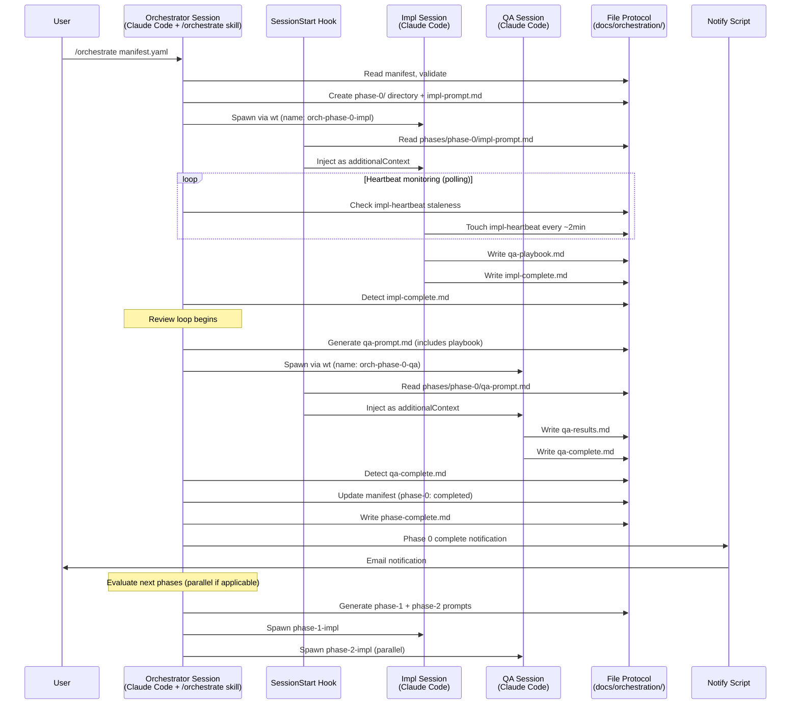
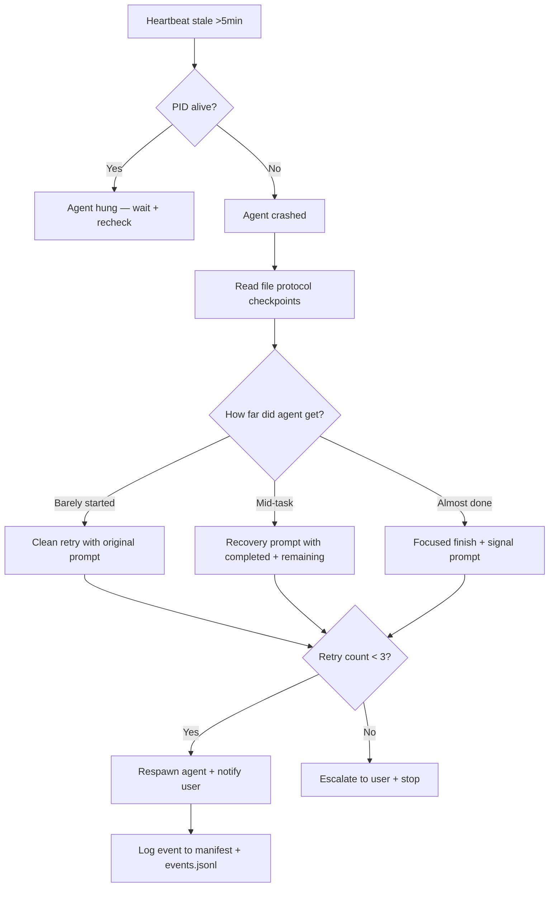

<!-- /autoplan restore point: /c/Users/dunliu/.gstack/projects/dunliu/no-branch-autoplan-restore-20260416-104000.md -->

# feat: Agent Orchestration Plugin for Claude Code

## Overview

Build a Claude Code plugin (`agent-orchestrator`) that automates multi-session phased development workflows. The plugin reads a YAML manifest defining phases, agent roles, and dependencies, then spawns visible Claude Code sessions, generates context-rich prompts, monitors progress via file-drop protocol, handles QA-impl review loops, recovers from crashes, and sends notifications — eliminating the manual copy-paste orchestration that currently consumes ~21% of session interactions.

## Problem Frame

Solo developer running phased builds across multiple Claude Code sessions must manually: generate handoff prompts, relay artifacts between implementation and QA agents, brief coordinator sessions, and copy-paste instructions across windows. This was measured across 596 messages / 90 sessions spanning yoga-house (8 phases), polymarket-quant, deal-seaker, and content-pipeline. (see origin: docs/brainstorms/2026-04-15-agent-orchestration-plugin-requirements.md)

## Requirements Trace

- R1. A phased build can be kicked off with a single `/orchestrate` command and run to completion with zero manual copy-paste between sessions
- R2. Every spawned agent runs in a visible, interactive Claude Code window the user can inspect and steer at any time
- R3. Each session has a dedicated role, focused context, and clean boundaries
- R4. Session crashes are automatically detected and recovered via checkpoint-based resumption within 5 minutes
- R5. The inter-agent file-drop protocol is orchestrator-agnostic (works with Claude Code plugin, Node.js daemon, or future OpenClaw)
- R6. The manifest accurately reflects current progress at all times (live status tracker)
- R7. QA ↔ impl review loops are automated (QA creates playbook → impl reviews → QA executes)
- R8. User is notified via email for phase completion, failures, and decisions needed

## Scope Boundaries

- V1 only supports Claude Code sessions (not OpenClaw, Codex, or Cowork)
- V1 has no visual dashboard (manifest-as-dashboard is sufficient)
- V1 uses polling-based monitoring (not event-driven file watchers)
- Does not replace `/ce:plan`, `/ce:work`, `/qa` — orchestrates them
- Does not run agents in the background invisibly
- No browser-based ChatGPT adapter in V1

### Deferred to Separate Tasks

- V2: Node.js file-watcher daemon for event-driven monitoring
- V2: Progress dashboard web UI
- V2: Multi-agent type adapters (OpenClaw, Codex, browser-ChatGPT)
- V2: Manifest structural change proposals with auto-apply + veto window
- V3: Proactive work discovery (scan git issues, Sentry, meeting notes)

## Context & Research

### Relevant Code and Patterns

- **Compound-engineering plugin structure**: `.claude-plugin/plugin.json` (metadata), `skills/*/SKILL.md` (auto-discovered), `agents/*/*.md`, `hooks/hooks.json`. No skills array in plugin.json — CLI discovers by convention.
- **Superpowers SessionStart hook pattern**: `hooks/hooks.json` defines SessionStart hooks that run a script. Script reads context, outputs JSON with `additionalContext` field. This is how initial prompt injection works.
- **SKILL.md format**: YAML frontmatter (`name`, `description`, `argument-hint`) + markdown body. References via backtick paths to `references/*.md`.
- **Claude CLI flags**: `-p` (non-interactive print), `-n` (session name), `--session-id` (deterministic UUID), `--model`, `--permission-mode auto`, `--dangerously-skip-permissions`, `--resume`.
- **Windows Terminal**: `wt -w 0 new-tab --title "name" cmd /k claude ...` spawns visible tabs.

### External References

- Elvis Sun's OpenClaw Agent Swarm article: tmux-based agent spawning, `active-tasks.json` registry, cron-based monitoring, PID tracking, multi-model code review
- Node.js v22.22.2 and npm v10.9.7 available on this machine

## Key Technical Decisions

- **Orchestrator is an external Node.js process, NOT a Claude Code session**: (Changed during /autoplan review — CEO + Eng both flagged context window exhaustion as critical.) A long-running `/loop` inside a Claude Code session accumulates ~300-500 tokens per poll tick. Over a multi-hour, multi-phase build, this exhausts the context window. Instead, `orchestrate.js` runs as a standalone Node.js process that reads all state from the file protocol on each tick (stateless). It only calls `claude -p` for operations that need LLM reasoning (prompt generation, crash analysis) — each as a fresh, isolated session with zero accumulated context.
- **Prompt injection via SessionStart hook**: Spawn interactive Claude sessions (not `-p`). A SessionStart hook detects the session name pattern (`orch-*`), reads the corresponding prompt file from `docs/orchestration/phases/`, and injects it as `additionalContext`. This gives the user full steerability while automating the initial prompt. **Risk:** The hook API env var for session name is unverified — Unit 4.5 spikes this before building. Fallback: flag-file protocol (orchestrator writes `.pending-{name}` before spawn, hook reads and deletes atomically).
- **Template interpolation for V1, LLM generation for V1.5**: (Changed during /autoplan review — CEO flagged compounding variance.) V1 uses deterministic `{{variable}}` interpolation on template files. The Node.js orchestrator reads plan excerpts, completion signals, and previous outputs, then fills templates. LLM-generated prompts deferred to V1.5 for specific cases where templates prove insufficient.
- **PID + timeout as primary crash detection, heartbeat as secondary**: (Changed during /autoplan review — CEO flagged unvalidated heartbeat compliance.) PID monitoring is deterministic. Timeout is configurable. Heartbeat remains in the protocol header as a bonus signal that gives earlier detection of hung agents, but crash recovery does not depend on it.
- **Split manifest: user-editable manifest.yaml + orchestrator-only manifest-status.yaml**: (Changed during /autoplan review — Eng flagged concurrent write risk.) The user edits `manifest.yaml` for structure (phases, agents, dependencies). The orchestrator writes `manifest-status.yaml` for runtime state (PIDs, timestamps, completion status). No locking needed — separate files, separate owners.
- **All scripts in Node.js, no PowerShell**: (Changed during /autoplan review — Eng flagged unnecessary language complexity.) Session spawning moved from `spawn-session.ps1` to `spawn-session.js` using `child_process.execSync`. Two-language stack (Node.js + SKILL.md markdown) instead of three.
- **Session spawning via `wt` + configurable launcher**: The spawn command is configurable per user environment. Default: direct `claude` invocation via `cmd /k`. User override example: Microsoft employees using the `agency` CLI wrapper run `agency claude --enable-auto-mode ...` from PowerShell. Launcher config lives in `docs/orchestration/launcher.yaml` (or in the manifest). The `orch-` prefix triggers the SessionStart hook (pending verification in Unit 4.5).
  ```yaml
  # Example launcher configs
  # Default (direct claude + cmd)
  launcher:
    shell: cmd
    binary: claude
    auto_mode_flag: "--permission-mode auto"

  # Microsoft agency wrapper (PowerShell)
  launcher:
    shell: powershell
    binary: "agency claude"
    auto_mode_flag: "--enable-auto-mode"
    shell_args: "-NoExit -Command"
  ```

## Open Questions

### Resolved During Planning

- **Template interpolation**: LLM-generated prompts, not `{{var}}` substitution. Templates are structural guides.
- **Interactive vs headless**: SessionStart hook injects prompt into interactive sessions. User can steer.
- **Heartbeat ownership**: Agent-side. Protocol header instructs agent.
- **Email mechanism**: Node.js nodemailer script.
- **Session naming**: `orch-{phase-id}-{role}` pattern detected by SessionStart hook.

### Deferred to Implementation

- Exact nodemailer SMTP configuration (Gmail app password vs. OAuth2)
- Whether `--permission-mode auto` propagates through the hook correctly or needs `--dangerously-skip-permissions`
- How the orchestrator's `/loop` polling interacts with context window growth over long runs
- Whether the heartbeat touch instruction is reliably followed by Claude agents across all task types
- Exact YAML parsing library (js-yaml vs. built-in)

## Output Structure

```
agent-orchestrator/
├── .claude-plugin/
│   └── plugin.json
├── hooks/
│   ├── hooks.json
│   ├── run-hook.cmd              # Windows hook runner
│   └── session-start.js          # Reads prompt file for orch-* sessions
├── skills/
│   ├── orchestrate/
│   │   ├── SKILL.md
│   │   └── references/
│   │       ├── orchestration-loop.md
│   │       ├── recovery-workflow.md
│   │       └── review-loop.md
│   └── manifest-gen/
│       ├── SKILL.md
│       └── references/
│           └── manifest-schema.md
├── agents/
│   └── orchestration/
│       ├── prompt-generator.md   # Generates context-rich prompts for worker agents
│       └── recovery-analyst.md   # Analyzes crash state and generates recovery prompts
├── templates/
│   ├── protocol-header.md        # Protocol instructions injected into every agent prompt
│   ├── impl-prompt.md            # Structural guide for implementation agent prompts
│   ├── qa-prompt.md              # Structural guide for QA agent prompts
│   ├── qa-playbook-prompt.md     # Guide for QA playbook creation prompts
│   ├── coordinator-briefing.md   # Guide for phase completion briefings
│   └── recovery-prompt.md        # Guide for crash recovery prompts
├── scripts/
│   ├── spawn-session.ps1         # PowerShell: spawns visible Claude Code tabs
│   ├── notify.js                 # Node.js: sends email notifications via nodemailer
│   ├── check-heartbeat.js        # Node.js: checks heartbeat staleness + PID liveness
│   └── package.json              # Dependencies: nodemailer, js-yaml
└── schema/
    ├── manifest-example.yaml     # Annotated example manifest
    └── completion-signal-example.md  # Annotated example completion signal
```

## High-Level Technical Design

> *This illustrates the intended approach and is directional guidance for review, not implementation specification. The implementing agent should treat it as context, not code to reproduce.*



**Crash recovery flow:**



## Implementation Units

### Phase 0: Prototype + Documentation (NEW — added by /autoplan review)

- [ ] **Unit 0: Shell-script prototype**

  **Goal:** A minimal script that proves the core loop works: parse manifest, spawn Claude Code sessions, poll for completion signals, and advance to the next phase. Use on one real project before building the full plugin.

  **Requirements:** R1, R2, R5

  **Dependencies:** None

  **Files:**
  - Create: `agent-orchestrator/prototype/orchestrate-prototype.js`
  - Create: `agent-orchestrator/prototype/README.md`

  **Approach:**
  - Single Node.js script (~200 lines) that reads a manifest YAML, spawns `wt` tabs with `claude --name`, and polls for completion signal files in a loop
  - No templates, no hook, no recovery, no email — just spawn + poll + advance
  - Validates the core assumptions: does `wt` open tabs reliably? Do Claude sessions write output files? Does the flow actually work end-to-end?
  - Run on a small real project (e.g., a 2-phase feature) to collect real-world friction data before building the full plugin

  **Test scenarios:**
  - Happy path: 2-phase manifest → spawns 2 sequential Claude sessions, detects completion files, reports "all done"
  - Error path: Claude session never writes completion file → hits timeout, reports stuck

  **Verification:** Successfully orchestrates a 2-phase build end-to-end with visible Claude Code windows and zero manual copy-paste.

- [ ] **Unit 0.5: README with quick-start and manifest reference**

  **Goal:** Documentation that lets a developer install and use the plugin without reading source code.

  **Requirements:** DX review finding (no docs is critical)

  **Dependencies:** Unit 0 (informed by prototype learnings)

  **Files:**
  - Create: `agent-orchestrator/README.md`
  - Create: `agent-orchestrator/docs/manifest-reference.md`

  **Approach:**
  - 3-step quick-start: install, point at a plan, run `/orchestrate`
  - `--demo` mode with a bundled example manifest that works without email config
  - Full manifest reference: every field, type, default value, and one-line description
  - Prerequisites section: Node.js version, Windows Terminal, Claude Code version
  - Annotated end-to-end example

  **Test scenarios:**
  - Happy path: A new user follows the quick-start and gets a working orchestrated build
  - Edge case: User skips email config → works fine with notifications disabled

  **Verification:** README is self-contained — a developer can install and use the plugin from README alone.

### Phase 1: Plugin Scaffold + Protocol Foundation

- [ ] **Unit 1: Plugin scaffold and directory structure**

  **Goal:** Create the minimal plugin structure that Claude Code can discover and load.

  **Requirements:** R5 (protocol-first — plugin structure must be standard)

  **Dependencies:** None

  **Files:**
  - Create: `agent-orchestrator/.claude-plugin/plugin.json`
  - Create: `agent-orchestrator/skills/orchestrate/SKILL.md` (stub)
  - Create: `agent-orchestrator/skills/manifest-gen/SKILL.md` (stub)
  - Create: `agent-orchestrator/templates/protocol-header.md`
  - Create: `agent-orchestrator/schema/manifest-example.yaml`
  - Create: `agent-orchestrator/schema/completion-signal-example.md`

  **Approach:**
  - Follow compound-engineering plugin conventions exactly
  - `plugin.json` contains only metadata (name, version, description, author, license)
  - Skills are stubs with correct frontmatter — implementation fills them in later units
  - `manifest-example.yaml` is the annotated reference manifest from the requirements doc
  - `completion-signal-example.md` shows the structured completion signal format

  **Patterns to follow:**
  - `compound-engineering/2.66.1/.claude-plugin/plugin.json` for plugin.json format
  - `compound-engineering/2.66.1/skills/ce-work/SKILL.md` for skill frontmatter format

  **Test scenarios:**
  - Happy path: `claude --plugin-dir ./agent-orchestrator --bare` loads without errors, `/orchestrate` appears in skill list
  - Edge case: Plugin loads alongside compound-engineering and superpowers without name collisions

  **Verification:** Claude Code recognizes the plugin and lists both skills when launched with `--plugin-dir`.

- [ ] **Unit 2: Manifest parser and validator**

  **Goal:** Parse and validate manifest YAML files, providing clear error messages for malformed manifests.

  **Requirements:** R1 (orchestrate command needs to read manifests), R6 (manifest as live tracker)

  **Dependencies:** Unit 1

  **Files:**
  - Create: `agent-orchestrator/scripts/parse-manifest.js`
  - Create: `agent-orchestrator/scripts/package.json`
  - Modify: `agent-orchestrator/schema/manifest-example.yaml` (add validation comments)

  **Approach:**
  - Node.js script using `js-yaml` to parse YAML
  - Validates required fields: `name`, `phases[]`, `phases[].id`, `phases[].agents[]`, `phases[].agents[].role`
  - Validates optional `launcher` block (shell, binary, auto_mode_flag, shell_args, passthrough_flags) against known schemas (default, agency, custom)
  - Validates optional `defaults` block (model, heartbeat_timeout_minutes, notifications.enabled, permission_mode) — all optional with documented fallback defaults
  - Validates dependency references (no dangling `depends_on` references)
  - Validates no circular dependencies between phases
  - Returns structured JSON to stdout for the orchestrator process to consume
  - Status updates now write to the separate `manifest-status.yaml` file (not the user-editable manifest) to eliminate concurrent-write conflicts

  **Patterns to follow:**
  - Standard Node.js CLI script pattern with process.argv parsing

  **Test scenarios:**
  - Happy path: Valid manifest parses correctly, all fields accessible
  - Happy path: `--update` mode modifies status fields without clobbering other content
  - Edge case: Manifest with no phases → clear error message
  - Edge case: Circular dependency (phase-1 depends on phase-2, phase-2 depends on phase-1) → detected and reported
  - Error path: Missing required fields → specific error naming the missing field
  - Error path: Invalid YAML syntax → parse error with line number

  **Verification:** Script parses the example manifest correctly. Script rejects intentionally malformed manifests with actionable errors.

- [ ] **Unit 3: File protocol directory scaffolding**

  **Goal:** Create the `docs/orchestration/` directory structure from a parsed manifest, setting up phase directories and copying templates.

  **Requirements:** R5 (protocol is the stable core), R3 (each session gets its own phase directory)

  **Dependencies:** Unit 2

  **Files:**
  - Create: `agent-orchestrator/scripts/scaffold-protocol.js`
  - Modify: `agent-orchestrator/scripts/package.json` (add script entry)

  **Approach:**
  - Reads parsed manifest, creates `docs/orchestration/phases/{phase-id}/` for each phase
  - Creates `docs/orchestration/logs/` directory
  - Initializes `docs/orchestration/logs/events.jsonl` as empty file
  - Copies template files to `docs/orchestration/templates/` (from plugin templates dir)
  - Idempotent: running twice doesn't destroy existing phase artifacts

  **Patterns to follow:**
  - Node.js `fs.mkdirSync` with `recursive: true`

  **Test scenarios:**
  - Happy path: All phase directories created from a 3-phase manifest
  - Edge case: Running twice on same manifest doesn't overwrite existing completion signals
  - Edge case: Manifest with `parallel_with` creates both phase directories

  **Verification:** Directory structure matches the protocol spec from the requirements doc.

### Phase 2: Session Spawning + Hook-Based Prompt Injection

- [ ] **Unit 4: Session spawner script (Node.js)**

  **Goal:** Node.js module that opens a new Windows Terminal tab running an interactive Claude Code session with a specific name. (Changed from PowerShell to Node.js — /autoplan Eng review: eliminate unnecessary language.)

  **Requirements:** R2 (visible, interactive windows), R3 (dedicated role per session)

  **Dependencies:** Unit 1

  **Files:**
  - Create: `agent-orchestrator/scripts/spawn-session.js`

  **Approach:**
  - Exported function: `spawnSession({ name, model, title, workdir, pluginDir, launcher })`
  - Reads launcher config (shell, binary, auto_mode_flag, shell_args) to construct the command
  - Default launcher (direct claude, cmd): `wt -w 0 new-tab --title "${title}" --startingDirectory "${workdir}" cmd /k claude --name "${name}" --model "${model}" --permission-mode auto --plugin-dir "${pluginDir}"`
  - Agency launcher (Microsoft wrapper, PowerShell): `wt -w 0 new-tab --title "${title}" --startingDirectory "${workdir}" powershell -NoExit -Command "agency claude --enable-auto-mode --name '${name}' --model '${model}' --plugin-dir '${pluginDir}'"`
  - Uses `child_process.execSync` to invoke `wt`
  - Returns spawned process info for PID monitoring
  - Handles edge case: no Windows Terminal window open yet (spawns new window via `wt new-tab` without `-w 0`)
  - Also exports `getSessionPid(name)` to check if a named session process is alive via `tasklist`

  **Patterns to follow:**
  - Elvis Sun's tmux session spawning pattern, adapted for Windows Terminal + Node.js
  - Launcher config must be verified compatible with the target binary (handled by Unit 4.5 spike)

  **Test scenarios:**
  - Happy path (default launcher): Spawns a visible Claude Code tab with correct title and session name via direct `claude` invocation
  - Happy path (agency launcher): Spawns a PowerShell tab running `agency claude --enable-auto-mode` with correct name and model
  - Edge case: No existing Windows Terminal window → opens new window instead of erroring
  - Edge case: Launcher config missing → falls back to default with warning
  - Error path: Binary not found (claude or agency) → clear error message with install instructions

  **Verification:** Running the module opens a new Windows Terminal tab with an interactive Claude session named `orch-test` under both default and agency launchers.

- [ ] **Unit 4.5: SessionStart hook API spike + launcher compatibility (NEW — added by /autoplan review, expanded for agency CLI)**

  **Goal:** Determine (a) what environment variables and stdin data are available inside a Claude Code SessionStart hook, and (b) whether hooks fire under wrapper CLIs like Microsoft's `agency` in addition to direct `claude`. This is the highest-risk unknown in the plan — the entire prompt injection mechanism depends on it, and the launcher mechanism is user-environment-specific.

  **Requirements:** R1 (prompt injection must work for zero-copy-paste orchestration)

  **Dependencies:** Unit 1

  **Files:**
  - Create: `agent-orchestrator/spikes/hook-env-spike.js`
  - Create: `agent-orchestrator/spikes/hook-env-spike-hooks.json`
  - Create: `agent-orchestrator/spikes/launcher-compat-findings.md`

  **Approach:**
  - Create a minimal plugin with a SessionStart hook that dumps ALL env vars and stdin to a file
  - **Test 1 — Direct claude:** Launch via `claude --plugin-dir ./agent-orchestrator --name orch-test-spike` from cmd
    - Does the hook fire?
    - Is `--name` exposed in env vars or stdin JSON?
    - Document all available context fields
  - **Test 2 — Agency wrapper:** Launch via `agency claude --enable-auto-mode --plugin-dir ./agent-orchestrator --name orch-test-spike` from PowerShell
    - Does the hook fire?
    - Does `--name` survive the wrapper?
    - Does `--plugin-dir` survive?
    - Are env vars different from direct claude?
  - **Test 3 — Hook from PowerShell:** Verify hooks work when launched from PowerShell vs. cmd (shell should be irrelevant but verify)
  - **Decision matrix based on findings:**

  | Scenario | Session name available? | Hook fires? | Plan path |
  |---|---|---|---|
  | Direct claude, name in env | Yes | Yes | Use name-based detection (Unit 5 as designed) |
  | Agency, name survives, hook fires | Yes | Yes | Same as above, launcher config just swaps binary |
  | Agency, name lost | No | Yes | Flag-file fallback: orchestrator writes `.pending-{name}` before spawn |
  | Agency, hook doesn't fire | N/A | No | Escalate: prompt-as-first-message mode. Orchestrator injects prompt via clipboard or as first user message (manual fallback) |

  **Fallback design (flag-file protocol):**
  - Orchestrator writes `docs/orchestration/.pending-{session-name}` immediately before `wt` spawn
  - Hook scans for ANY `.pending-*` file on startup
  - Hook reads the first match, deletes it atomically, injects its prompt content
  - Stale `.pending-*` files older than 60s are ignored (previous failed spawn)
  - Document all findings in launcher-compat-findings.md for future users

  **Test scenarios:**
  - Happy path: Direct claude env dump reveals session name → direct detection works
  - Happy path: Agency launcher env dump reveals session name → agency launcher works identically
  - Fallback path: Session name lost under agency → flag-file protocol tested end-to-end
  - Worst case: Hook doesn't fire under agency → document the limitation and recommend direct claude for orchestrated sessions

  **Verification:** We know exactly which launcher configurations support orchestration, which need the flag-file fallback, and which are incompatible. User can choose their launcher accordingly.

- [ ] **Unit 5: SessionStart hook for prompt injection**

  **Goal:** When a Claude session starts with an `orch-*` name, the hook reads the corresponding prompt file and injects it as the initial context.

  **Requirements:** R1 (no manual copy-paste), R2 (interactive sessions with automated first prompt)

  **Dependencies:** Unit 1, Unit 3

  **Files:**
  - Create: `agent-orchestrator/hooks/hooks.json`
  - Create: `agent-orchestrator/hooks/run-hook.cmd`
  - Create: `agent-orchestrator/hooks/session-start.js`

  **Approach:**
  - `hooks.json` registers a SessionStart hook
  - `session-start.js` reads the `CLAUDE_SESSION_NAME` (or equivalent) environment variable
  - If name matches `orch-{phase-id}-{role}`, constructs path: `docs/orchestration/phases/{phase-id}/{role}-prompt.md`
  - If prompt file exists, reads it and outputs JSON: `{"additionalContext": "content..."}`
  - If prompt file doesn't exist or name doesn't match, outputs empty JSON (no-op)
  - `run-hook.cmd` is the Windows wrapper that runs `node session-start.js`

  **Patterns to follow:**
  - `superpowers/5.0.7/hooks/hooks.json` for hook registration format
  - `superpowers/5.0.7/hooks/session-start` for additionalContext injection pattern

  **Test scenarios:**
  - Happy path: Session named `orch-phase-0-impl` reads `phases/phase-0/impl-prompt.md` and injects it
  - Edge case: Session named `my-feature` (no `orch-` prefix) → hook is no-op
  - Edge case: Prompt file doesn't exist yet (session spawned before prompt generated) → hook is no-op, agent starts with no injected context
  - Error path: Malformed prompt file → hook outputs error context so user sees it

  **Verification:** Launch `claude --plugin-dir ./agent-orchestrator --name orch-phase-0-impl` with a prompt file at the expected path. Claude's first system context includes the prompt content.

### Phase 3: Prompt Generation + Templates

- [ ] **Unit 6: Protocol header template and prompt templates**

  **Goal:** Create the template files that guide prompt generation — the protocol header every agent receives, and the structural templates for impl, QA, and recovery prompts.

  **Requirements:** R3 (focused context per role), R5 (protocol instructions in every prompt)

  **Dependencies:** Unit 1

  **Files:**
  - Create: `agent-orchestrator/templates/protocol-header.md`
  - Create: `agent-orchestrator/templates/impl-prompt.md`
  - Create: `agent-orchestrator/templates/qa-prompt.md`
  - Create: `agent-orchestrator/templates/qa-playbook-prompt.md`
  - Create: `agent-orchestrator/templates/coordinator-briefing.md`
  - Create: `agent-orchestrator/templates/recovery-prompt.md`

  **Approach:**
  - Protocol header: role assignment, file protocol paths, heartbeat instructions, completion signal format, git commit instructions
  - Impl template: plan excerpt section, previous phase context section, implementation instructions, signal-on-complete instructions
  - QA template: playbook reference, test execution instructions, results format, signal-on-complete
  - Recovery template: crash context, completed checkpoints, remaining work, resume instructions
  - Templates are structural guides read by the prompt-generator agent, not string-interpolation targets

  **Patterns to follow:**
  - `compound-engineering/templates/impl-prompt.md` conceptual pattern (if exists)
  - The protocol header from the requirements doc

  **Test scenarios:**
  - Test expectation: none — these are static template files. Quality verified during integration testing in Unit 8.

  **Verification:** Templates are complete, well-structured, and cover all the protocol requirements from the origin document.

- [ ] **Unit 7: Template-based prompt generator (Node.js)**

  **Goal:** A Node.js module that generates context-rich prompts by interpolating templates with plan excerpts, completion signals, and manifest context. (Changed from LLM sub-agent to deterministic template interpolation — /autoplan CEO review: eliminate compounding variance.)

  **Requirements:** R1 (automated prompt generation), R3 (focused context)

  **Dependencies:** Unit 6

  **Files:**
  - Create: `agent-orchestrator/scripts/generate-prompt.js`

  **Approach:**
  - Exported function: `generatePrompt({ role, phaseId, planPath, manifestPath, previousOutputs })`
  - Reads the appropriate template file for the role (impl/qa/recovery)
  - Reads the plan file and extracts implementation units for this phase (by parsing phase markers or unit IDs referenced in manifest)
  - Reads completion signals from dependency phases (determined by manifest `depends_on`)
  - Performs `{{variable}}` interpolation: `{{protocol_header}}`, `{{plan_units}}`, `{{previous_phase_briefing}}`, `{{phase_id}}`, `{{role}}`, `{{output_paths}}`
  - Writes the assembled prompt to `docs/orchestration/phases/{phase-id}/{role}-prompt.md`
  - For V1.5: add an `--llm` flag that calls `claude -p` for cases where templates prove insufficient (complex recovery scenarios, cross-phase context assembly)

  **Patterns to follow:**
  - Simple string replacement (no Handlebars/Mustache dependency — just `template.replace(/\{\{var\}\}/g, value)`)

  **Test scenarios:**
  - Happy path: Given phase-0 impl role + plan → generates prompt with protocol header, correct plan units, and impl instructions
  - Happy path: Phase with `depends_on` completed phase → previous phase's completion briefing included
  - Edge case: Template variable not found in context → leaves placeholder with warning comment
  - Error path: Plan file not found → clear error

  **Verification:** Generated prompts contain correct protocol headers, correct plan excerpts for the specified phase, and are deterministic (same inputs → same output).

### Phase 4: Monitoring + Health Checks

- [ ] **Unit 8: Health checker (PID + timeout primary, heartbeat secondary)**

  **Goal:** Scripts that check whether spawned agent sessions are alive. Primary detection: PID liveness + timeout. Secondary: heartbeat staleness. (Changed — /autoplan CEO review: heartbeat compliance is unvalidated, PID+timeout must be primary.)

  **Requirements:** R4 (crash detection within 5 minutes)

  **Dependencies:** Unit 2, Unit 4

  **Files:**
  - Create: `agent-orchestrator/scripts/check-health.js`

  **Approach:**
  - Takes phase ID + role as arguments
  - **Primary detection:** Checks PID liveness via `tasklist /FI "PID eq X"` on Windows. PID gone = crashed.
  - **Primary detection:** Checks elapsed time against configurable timeout from manifest. Timeout exceeded = stuck/dead.
  - **Secondary detection:** If heartbeat file exists, checks staleness (mtime > 5min). Stale heartbeat + PID alive = possibly hung (bonus signal).
  - Returns JSON status: `{ alive: bool, pidAlive: bool, timedOut: bool, heartbeatAge: seconds|null, lastCheckpoint: "filename" }`
  - Scans phase directory for existing artifacts to determine last checkpoint (for recovery context)

  **Patterns to follow:**
  - Elvis's `.clawdbot/check-agents.sh` pattern, adapted for Node.js + Windows

  **Test scenarios:**
  - Happy path: Running agent with fresh heartbeat → `{ alive: true }`
  - Happy path: Crashed agent (PID gone + stale heartbeat) → `{ alive: false, lastCheckpoint: "qa-playbook.md" }`
  - Edge case: Heartbeat stale but PID still alive → `{ alive: true }` (agent might be doing a long operation)
  - Edge case: No heartbeat file at all + PID gone → agent never started or crashed immediately

  **Verification:** Script correctly identifies alive vs. dead agent sessions in test scenarios.

### V1.5 Deferred Units (moved from V1 by /autoplan review)

> Units 9, 10, and 12 were reclassified as V1.5. They add value but are not needed for the core orchestration loop. Build them after V1 is validated on a real project.

- [ ] **Unit 9 (V1.5): Recovery analyst agent** — LLM-powered crash analysis that reads git log, classifies recovery strategy, and generates intelligent recovery prompts. V1 uses deterministic recovery (template-based recovery prompt with checkpoint context).

- [ ] **Unit 10 (V1.5): Email notifications** — nodemailer script for phase_complete, agent_failed, decision_needed, all_done events. V1 prints to terminal only.

- [ ] **Unit 12 (V1.5): `/orchestrate --init` manifest generator** — reads a `/ce:plan` output and scaffolds a manifest. V1 requires manual manifest creation (using manifest-example.yaml as reference).

### Phase 5: Core Orchestration Skill

- [ ] **Unit 11: Main orchestrator — Node.js process + `/orchestrate` skill entry point**

  **Goal:** The primary orchestration engine: a Node.js process that reads the file protocol, manages the lifecycle of all phases and agents, and only calls Claude for operations requiring LLM reasoning. The `/orchestrate` skill is a thin entry point that validates the manifest and starts the Node.js process. (Fundamentally changed — /autoplan CEO + Eng review: must be external process to avoid context window exhaustion.)

  **Requirements:** R1, R2, R3, R4, R5, R6, R7 (all requirements converge here; R8 email deferred to V1.5)

  **Dependencies:** Units 2, 3, 4, 4.5, 5, 6, 7, 8

  **Files:**
  - Create: `agent-orchestrator/scripts/orchestrate.js` (main Node.js orchestrator process)
  - Modify: `agent-orchestrator/skills/orchestrate/SKILL.md` (thin entry point: validate manifest, start orchestrate.js)
  - Create: `agent-orchestrator/skills/orchestrate/references/review-loop.md` (QA↔impl review loop spec, drafted in Unit 6)

  **Approach:**

  **`orchestrate.js` — the stateless event loop:**

  ```
  1. INITIALIZE: Parse manifest, validate, scaffold protocol dirs, generate initial prompts
  2. MAIN LOOP (every 2 minutes):
     a. Re-read manifest.yaml + manifest-status.yaml (stateless — no accumulated context)
     b. For each phase with status=pending and all dependencies met:
        - Generate prompts via generate-prompt.js (template interpolation)
        - Spawn sessions via spawn-session.js
        - Record PIDs in manifest-status.yaml
        - Update phase status to "running"
     c. For each phase with status=running:
        - Check agent health via check-health.js (PID + timeout primary)
        - Check for completion signals (file existence)
        - If completion detected: update manifest-status, check review loop
        - If crash detected (PID gone, retry < 3): generate recovery prompt, respawn
        - If crash detected (retry >= 3): mark failed, log, print to terminal
     d. For review loops:
        - When impl completes and phase has review_loop.enabled:
          Generate QA prompt including impl's qa-playbook.md, spawn QA session
        - QA writes qa-verdict.json: { pass: bool, failures: [...] }
        - Max 3 review iterations, then escalate to user
        - Each QA cycle is a fresh spawn (not resume)
     e. When all phases complete: print summary to terminal, update manifest-status
  3. RESUME MODE (--resume flag):
     Read manifest-status.yaml, skip completed phases, respawn crashed agents, enter main loop
  ```

  **`/orchestrate` skill — thin entry point:**
  - Validates manifest exists and is well-formed
  - Runs `npm install` in scripts/ if `node_modules` missing
  - Starts `node scripts/orchestrate.js manifest.yaml` as a background process
  - Outputs: "Orchestrator started. PID: XXXX. Monitoring docs/orchestration/. Ctrl+C to stop."

  **Key design constraints (from reviews):**
  - Orchestrator re-reads ALL state from files each tick. No in-memory accumulation.
  - Only calls `claude -p` when LLM reasoning is actually needed (V1: never in the main loop; V1.5: for recovery analysis and complex prompt generation)
  - Errors are surfaced to the terminal with structured blocks: problem / file / fix hint
  - QA verdict is structured JSON with `{pass: bool, failures: [{test, expected, actual}]}`

  **Patterns to follow:**
  - Elvis's `check-agents.sh` cron pattern (deterministic polling, no LLM in the monitor loop)
  - The orchestration sequence diagram from this plan

  **Test scenarios:**
  - Happy path: Single-phase manifest with impl + QA → spawns impl, detects completion, spawns QA, detects QA completion, prints summary
  - Happy path: Multi-phase with parallel phases → phases with met dependencies spawn simultaneously
  - Happy path: `--resume` after machine restart → reconstructs state from file protocol, respawns crashed agents
  - Edge case: Phase `depends_on` a failed phase → blocks and prints decision-needed to terminal
  - Edge case: User edits manifest.yaml mid-run (pauses a phase) → orchestrator re-reads on next tick, respects the change
  - Error path: Manifest file not found → clear error with usage instructions
  - Error path: Spawned session crashes immediately (PID gone within 30s) → detected on next tick, recovery prompt generated, respawned
  - Integration (crash recovery): Agent crashes after writing qa-playbook.md → recovery prompt includes checkpoint, agent resumes from correct point
  - Integration (nested crash): Recovery-spawned agent itself crashes → retry count increments, re-recovers (not infinite loop)
  - Integration (full restart): Kill all processes + orchestrator → `--resume` reconstructs from file artifacts, ignoring stale PIDs

  **Verification:** A 2-phase manifest runs from `/orchestrate` to completion with all sessions visible, review loops executing, and manifest-status.yaml accurately tracking progress throughout. The orchestrator process itself uses zero Claude Code context window.

### Phase 6: Manifest Generator (V1.5)

See Unit 12 in V1.5 Deferred Units above.

## System-Wide Impact

- **Interaction graph**: The orchestrator skill dispatches sub-agents (prompt-generator, recovery-analyst), spawns external Claude sessions, and calls scripts (parse-manifest, spawn-session, check-heartbeat, notify). The SessionStart hook intercepts every Claude session start but is a no-op for non-orchestrated sessions.
- **Error propagation**: Script failures (spawn, notify, heartbeat-check) are caught by the orchestrator skill and logged to events.jsonl. They do not crash the orchestrator. Agent crashes are detected and recovered. Email failures are logged but non-blocking.
- **State lifecycle risks**: Manifest YAML is the single source of truth for progress. Concurrent writes (orchestrator updating status while user edits) could conflict — V1 mitigates by having the orchestrator own status fields and the user own structural fields.
- **API surface parity**: The file protocol is the shared API surface. Any orchestrator (Claude Code plugin, Node.js daemon, OpenClaw) can drive the same protocol. Worker agents only know about the protocol, not the orchestrator.
- **Unchanged invariants**: `/ce:plan`, `/ce:work`, `/qa`, and all other compound-engineering skills are unchanged. The orchestrator calls them; it does not modify them.

## Risks & Dependencies

| Risk | Likelihood | Impact | Mitigation |
|------|-----------|--------|------------|
| SessionStart hook can't reliably read session name | Medium | High | Unit 4.5 spikes this before building. Fallback: flag-file protocol with atomic write/read/delete. |
| Claude agents don't reliably follow heartbeat protocol | Medium | Low | **Resolved:** Heartbeat demoted to secondary. PID+timeout is primary. Crash detection works without heartbeat. |
| Long orchestration loops exhaust coordinator's context window | N/A | N/A | **Resolved:** Orchestrator is a stateless Node.js process, not a Claude Code session. Zero context accumulation. |
| Anthropic ships native multi-session orchestration | Medium | High | Protocol-first design survives: file-drop convention and manifest format remain useful regardless. Ship fast, learn fast. |
| Template interpolation proves too rigid for complex prompts | Medium | Medium | V1.5 adds LLM generation for specific cases. Measure first, add complexity second. |
| Windows Terminal `wt` command behavior varies across versions | Low | Medium | Test on this machine in Unit 0 prototype. Document minimum WT version in README. |
| QA-impl review loop cycles indefinitely | Low | High | Max 3 iterations per phase. QA writes structured qa-verdict.json. Exceeding cap escalates to user. |
| Wrapper CLIs (e.g., Microsoft `agency`) don't preserve `--name`/`--plugin-dir` or suppress hooks | Medium | High | Unit 4.5 spike tests agency compatibility explicitly. Flag-file fallback protocol available if session name is lost. If hooks don't fire under wrapper, document as unsupported — user runs orchestrated sessions via direct `claude` instead. |
| Launcher config (shell, binary, flags) varies per user environment | Low | Low | Configurable `launcher` block in manifest/user config. Default ships as direct `claude` + cmd; agency config documented as first alternative. |

## Documentation / Operational Notes

- Plugin README.md should include: installation, manifest format reference, quick-start guide
- CLAUDE.md for projects using the orchestrator should note the file protocol convention
- Events log (`events.jsonl`) serves as an audit trail for debugging orchestration issues

## Sources & References

- **Origin document:** [docs/brainstorms/2026-04-15-agent-orchestration-plugin-requirements.md](docs/brainstorms/2026-04-15-agent-orchestration-plugin-requirements.md)
- Related pattern: compound-engineering plugin structure (`~/.claude/plugins/cache/compound-engineering-plugin/compound-engineering/2.66.1/`)
- Related pattern: superpowers SessionStart hook (`~/.claude/plugins/cache/claude-plugins-official/superpowers/5.0.7/hooks/`)
- External inspiration: Elvis Sun's OpenClaw Agent Swarm article (local copy at `projects/OpenClaw + CodexClaudeCode Agent Sw.txt`)

## GSTACK REVIEW REPORT

| Review | Trigger | Why | Runs | Status | Findings |
|--------|---------|-----|------|--------|----------|
| CEO Review | `/autoplan` | Scope & strategy | 1 | issues_resolved | 7 findings (3 critical, 2 high, 1 medium). All auto-decided. 2 taste decisions surfaced, approved. |
| Eng Review | `/autoplan` | Architecture & tests | 1 | issues_resolved | 6 findings (2 critical, 2 high, 2 medium). All auto-decided. Architecture fundamentally changed. |
| DX Review | `/autoplan` | Developer experience gaps | 1 | issues_resolved | 6 findings (1 critical, 3 high, 2 medium). All auto-decided. README and quick-start added. |
| Design Review | — | UI/UX gaps | 0 | skipped | No UI scope detected. |
| Codex Review | `/autoplan` | Independent 2nd opinion | 0 | unavailable | Not in a git repo — codex exec requires a trusted directory. |

**Key architecture changes from review:**
1. Orchestrator moved from Claude Code `/loop` session to stateless Node.js process (eliminates context window exhaustion)
2. Template interpolation replaces LLM prompt generation for V1 (eliminates compounding variance)
3. PID+timeout primary crash detection, heartbeat secondary (eliminates unvalidated premise)
4. Split manifest into user-editable + orchestrator-status files (eliminates concurrent write risk)
5. All scripts consolidated to Node.js (default launcher uses cmd; PowerShell supported via configurable launcher for wrapper CLIs)
6. Units 9, 10, 12 deferred to V1.5 (right-sizes scope)
7. Shell-script prototype (Unit 0) and README (Unit 0.5) added as new first steps
8. Configurable launcher block added to support wrapper CLIs like Microsoft's `agency claude --enable-auto-mode` (added post-review when user shared actual runtime setup)
9. Unit 4.5 spike expanded to test launcher compatibility (direct claude vs. agency wrapper) explicitly

**VERDICT:** APPROVED — plan reviewed and updated with all critical findings resolved. Ready for `/ce:work`.

## Unit 0 Validation Findings (2026-04-17)

Ran the prototype against `claude-skills` session-handoff plan, Units 1 and 2.
Kickoff was one paste per phase; everything else was unsupervised.

**Execution summary:** Phase 0 = 9m 31s, Phase 1 = 10m 0s, total 19m 31s.
Zero manual intervention between phases. No crashes or timeouts.

**Deliverables verified by file inspection:**
- `skills/session-handoff/SKILL.md` (482 lines) — frontmatter, Phase 1a–1e (git, plans, checkpoint, CLAUDE.md, conversation synthesis), Phase 2 parser with 9 worked examples, `Phase 3-5 (reserved)` stub for Units 3–5.
- `skills/session-handoff/references/message-templates.md` (304 lines) — Base Template, 5 role preambles, 5 message-type overrides, composition algorithm.
- `skills/session-handoff/references/sanitization-patterns.md` — skeleton only. Phase 1 agent explicitly flagged it as "deliberately not modified" (Unit 3's scope). Scope discipline held.

### Prototype-validated (demonstrated by the Unit 0 code itself)

1. **`workdir` field needed.** Manifest at `claude-skills/docs/orchestration/` vs. spawn cwd at `claude-skills/` root — prototype initially assumed they were the same. Resolved by adding optional top-level `workdir` (absolute or relative to manifest dir), and the prototype ships with it working. Unit 4 (`spawn-session.js`) already anticipates a `workdir` parameter — carry through, document in Unit 2's parser and Unit 11's schema.

2. **`wt --suppressApplicationTitle` is required for tab-title persistence.** Without it, tab titles revert to "PowerShell" then "Claude Code" within seconds, defeating the `orch-<phase>-<role>` naming. The prototype includes this flag in its `wt` command. **Action:** Unit 4's spawn command must retain it.

3. **Launcher schema is already straining.** `binary` + `auto_mode_flag` + V1's `shell_args` + `passthrough_flags` is patchwork. Current prototype concatenates `binary + auto_mode_flag` into a shell string; that breaks with paths containing spaces or embedded quotes. **Action:** Unit 4 should redesign this as a structured `argv`-shaped launcher spec (shell, pre-flags, binary, post-flags) instead of bolting on more string fields.

### Empirical run observations (from the actual session-handoff execution, not things the Unit 0 code itself proves)

4. **Completion-signal handoff notes exceeded their freeform spec and became a structured coordination channel.** Phase 0 documented SKILL.md's section structure so Phase 1 knew exactly where to splice ("`## Phase 2-5 (reserved)` anchor"), plus 6 preserved design decisions. Phase 1 pre-paved Unit 3 with invariants. **Action:** Unit 6's `protocol-header.md` should make the handoff-notes schema **first-class and structured** (required fields: files_modified, files_deliberately_skipped, design_calls_next_phase_should_know, blockers/open_questions), not a freeform "anything the next phase needs" invitation.

5. **Manual prompt paste is the dominant friction.** 2 paste actions for 2 phases. Scales linearly. **Action:** Unit 5 (SessionStart hook) is the clearest next ROI after Unit 1 scaffolding.

6. **No git bootstrap in prompts.** Agents did not stage or commit; left work uncommitted. **Action:** Unit 6's `impl-prompt.md` template should include an explicit "commit your work with message X" clause. Unit 11's orchestrator should treat commit presence as a secondary completion check.

7. **Tab accumulation.** Two live tabs after two phases; N phases → N tabs. **Action:** Unit 11 should close or mute completed tabs on phase advance. Add optional config: `close_tabs_on_success`.

8. **30-second poll cadence was adequate.** Detection lag on Phase 1 was under 30s (signal appeared at 04:22:13, detected same tick). Unit 11's 2-minute default for multi-hour builds is fine; for short phases, make the interval configurable (30s – 2min).

9. **Session-name mechanism untested under `agency` wrapper.** Prototype omits `--name` and `--plugin-dir` entirely (leaving them to Unit 5's hook era). Unit 4.5 spike still required — nothing in Unit 0 de-risks it.

**No fundamental revisions required.** The architecture holds. All findings are implementation-detail tuning, not structural.

### Post-review fixes (codex, 2026-04-17)

Codex `review` pass on the initial commit surfaced 2 P1 and 5 P2 findings. Addressed:

- **P1:** `--poll-seconds` and `phase.timeout_minutes` now validate as positive integers; non-numeric input fails fast with a clear message instead of producing NaN deadlines or tight polling loops.
- **P1 / P2:** Manifest-reference claim that `binary` supports "spaces and full paths" tempered. Docs now flag the concatenation-into-shell-string as a known prototype limitation and point at Unit 4 for proper argv construction. See finding 3 above.
- **P2:** `launcher.shell` now validated against a literal whitelist (`powershell | cmd`); typos like `pwsh` error at parse time instead of silently falling into the `cmd` branch.
- **P2:** Manifest reference stopped claiming prototype enforces `phase.id` uniqueness (it only checks presence). Corrected `title` docs (runtime title is `orch-<id>-<role> — <title>`, not `id`).
- **P2:** Top-level README opening paragraph no longer describes review loops, crash recovery, and notifications as present — it names the current shipped scope explicitly (Unit 0 only).
- **P2 (this section):** Findings above are now split into "Prototype-validated" vs "Empirical run observations" so the reader can tell which claims are anchored in the Unit 0 code and which are from the real-world test run.
