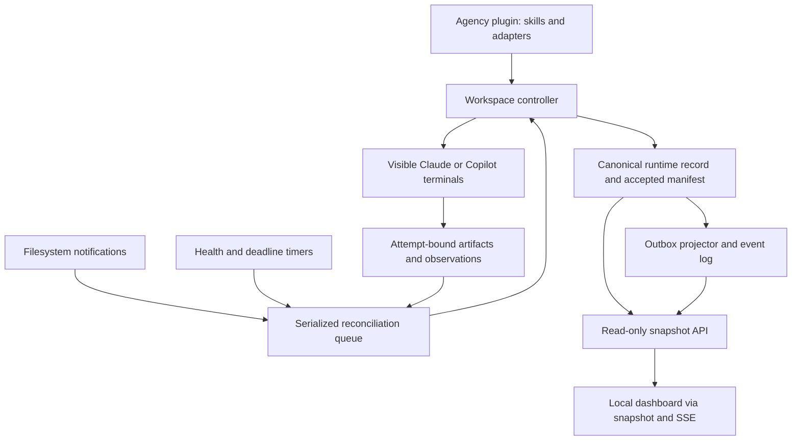
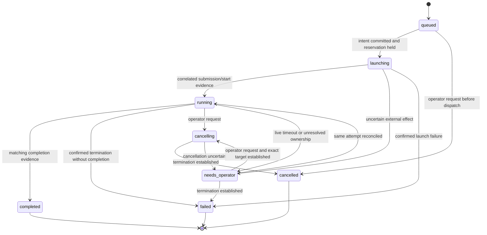
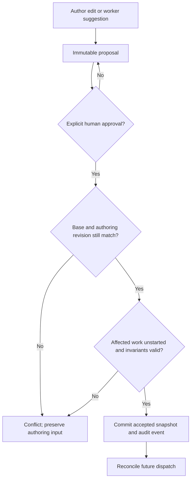
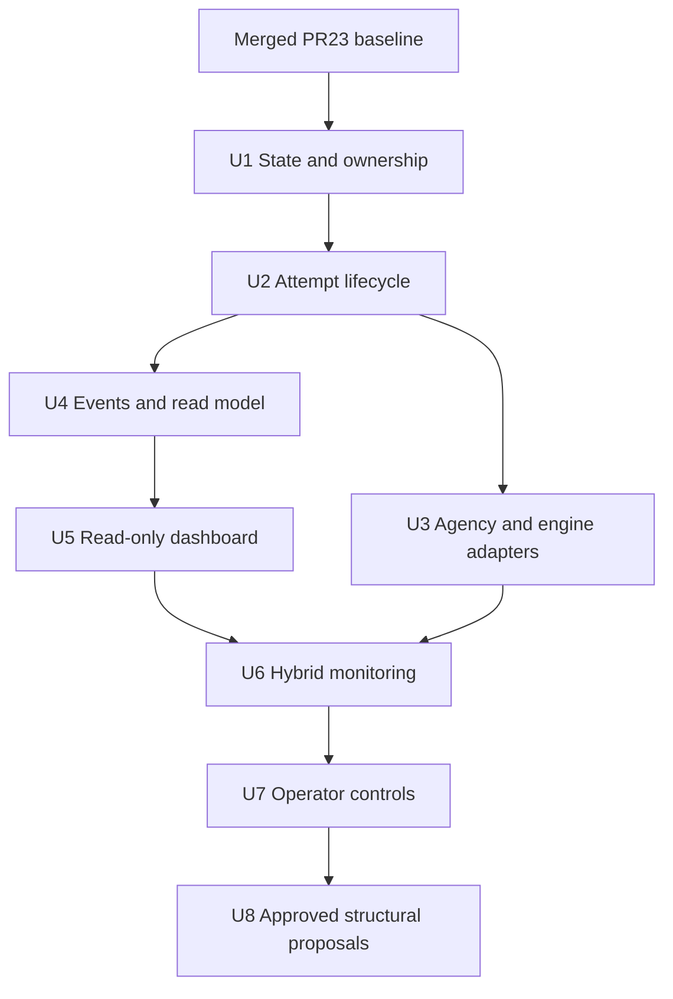

# Agency Orchestration V2 - Plan

## Goal Capsule

| Field | Contract |
|---|---|
| Objective | Extend the existing controller into an Agency-distributed plugin with visible Claude/Copilot workers, dependable execution ownership, a local progress dashboard, hybrid monitoring, and human-approved structural proposals. |
| Authority | The user-confirmed V2 scope and this Product Contract supersede the original brainstorm's unattended structural auto-apply proposal. Preserve the file protocol, role separation, and visible-worker goals. |
| Execution posture | Add characterization coverage around dispatch and restart before changing behavior; implement new state transitions test-first using the existing Node test framework. |
| Launch prerequisite | Start from merged PR #23, commit `e0c97c39c03de81c0cd53c17b62c3b6752647138`, or a descendant. Preserve the reviewed launch and restart fixes. |
| Stop conditions | Stop dispatch on uncertain ownership, unsupported interactive task submission, invalid accepted state, or inability to persist intent. Surface product-scope or approval-policy conflicts to the operator. |
| Completion | The Verification Contract and Definition of Done govern completion. Mocked launches alone cannot satisfy engine acceptance. |
| Landing boundary | This plan is versioned with explicit user approval for this personal repository. Review incremental implementation changes by unit; keep execution progress outside the plan and do not cite plan files in code comments or PR descriptions. |

---

## Product Contract

### Summary

V2 preserves visible, steerable worker sessions and the external Node.js controller.
It adds Agency/Copilot support, reliable per-attempt state, a local progress dashboard, event-triggered monitoring backed by timers, and explicit operator controls.
Structural changes require human approval.
Editing workers sharing one checkout run serially; independent editing requires separate working directories.

### Problem frame

The original workflow loses time to manual prompt and artifact relay between role-specific sessions.
V1 implements most of that coordination, but the runtime cannot yet reliably distinguish every worker attempt, prove task delivery, or expose a durable progress history.
More engines and faster monitoring would increase the consequences of ambiguous ownership and stale completion signals.

### Actors

- A1. Operator: starts a run, steers visible workers, inspects progress, controls scheduling, and approves structural changes.
- A2. Worker: performs its assigned role and reports attempt-bound artifacts; it cannot authorize structural changes or override uncertain ownership.
- A3. Controller: validates requests, owns runtime state, dispatches workers, reconciles observations, and exposes consistent read models.

### Requirements

#### Execution and compatibility

- R1. A V2 run can dispatch visible, interactive workers through Agency/Copilot while retaining supported Claude launch paths and deterministic role prompts.
- R2. Every dispatch has a durable run, phase, role, review-iteration, and attempt identity before launching; accepted observations must match the intended attempt.
- R3. Restart preserves dispatch intent, review stage, pause state, and retry budgets without automatically replaying an ambiguously submitted task.
- R4. At most one controller owns a canonical workspace, and at most one code-mutating attempt owns each shared working directory.
- R5. Confirmed termination may trigger bounded recovery; live timeouts and uncertain liveness require intervention without spawning a competing worker.
- R6. V1 history remains readable, V2 activation is explicit, and active uncorrelated V1 workers are never silently adopted into V2.

#### Observation and control

- R7. The local dashboard shows phase dependencies, role attempts, review iterations, blockers, artifacts, controller freshness, and the evidence supporting completion.
- R8. Committed transitions have durable event identities; reconnect and crash recovery must not show duplicate logical events or fabricate missing history.
- R9. File events accelerate reconciliation without replacing deadline checks, process observations, startup scans, or periodic full scans.
- R10. CLI and skill share inspection and non-confirming operator commands; the skill hands human-only approvals to the operator's terminal, and the first dashboard remains read-only.
- R11. Pause prevents all new dispatch while continuing to observe running workers and accept their results.

#### Structural changes and trust

- R12. Structural changes apply only after explicit human approval of an immutable proposal against the current accepted revision and execution state.
- R13. Started work, workspace identity, permissions, and required verification cannot be silently rewritten; concurrent authoring edits are preserved.
- R14. Worker artifacts and proposals are untrusted inputs to the controller; worker-accessible capabilities cannot approve proposals or impersonate an operator by supplying a role field.

### Key flows

- F1. Start: validate the accepted workflow, acquire workspace ownership, persist dispatch intent, launch the chosen engine, correlate task submission, and display the attempt.
- F2. Complete: accept matching evidence, record its provenance, release only proven-safe scheduling reservations, and advance dependencies or the review cycle.
- F3. Recover: reconcile persisted intent and process identity after failure, restart, or sleep; preserve uncertainty instead of duplicating work.
- F4. Inspect/control: the operator reads a consistent snapshot and issues an idempotent pause, resume, cancel, or retry request through the controller.
- F5. Replan: an authoring edit or worker suggestion becomes a proposal; human approval accepts a validated snapshot without overwriting the authoring file.

### Acceptance examples

- AE1. Given two workers with different assignments, when they launch through Agency/Copilot, each starts its own task once in a visible terminal and remains steerable.
- AE2. Given a live worker whose submission acknowledgement was lost, when the controller restarts, it reconciles or requests intervention without launching a duplicate.
- AE3. Given replacement attempt B, when old attempt A writes completion or QA evidence, B cannot complete from that evidence.
- AE4. Given a paused run, when impl completes, its result is recorded but QA and recovery dispatch remain paused.
- AE5. Given dropped filesystem notifications or a burst of duplicate events, completion is eventually detected and unknown liveness does not escalate faster than the health schedule.
- AE6. Given a proposal whose base changed or whose affected work has started, approval fails without changing accepted state or overwriting the user's authoring edits.
- AE7. Given a completed worker report without independent verification evidence, the dashboard labels it as reported completion rather than independently verified success.
- AE8. Given an exhausted retry budget and safely released prior ownership, explicit human authorization grants one additional attempt without resetting history or bypassing QA.

### Scope boundaries

This plan targets one local operator on Windows with Windows Terminal.
V2 requires each declared working directory to resolve inside a Git worktree.
The controller may be detached from the initiating CLI session, but worker sessions remain visible.
Separate pre-existing working directories may be used for parallel editing; automatic worktree provisioning and integration are deferred.

The following original goals remain: focused role context, deterministic handoffs, inspectable artifacts, graceful recovery, an engine-independent file protocol, and orchestration of existing development skills.
The shipped impl-to-QA-to-retry workflow remains the baseline; the original separate QA-design/impl-review/QA-execution choreography is not reintroduced here.

#### Deferred to follow-up work

- Email, desktop toast, Telegram, and other external notifications; the dashboard exposes decisions without claiming push delivery.
- LLM recovery analysis, semantic checkpoint reconstruction, manifest generation from plans, and historical timeout calibration.
- Controller-executed build/CI verification gates; V2 exposes the distinction between reported and independently verified evidence.
- Browser dashboard mutation controls, remote access, mobile access, multi-user authentication, and automatic machine-start service installation.
- OpenClaw, Codex, browser-ChatGPT, ACP-based alternative frontends, and other additional worker adapters.
- Automatic worktree creation, branch integration, cross-project scheduling, proactive work discovery, and prompt-learning loops.
- Unattended structural auto-apply, including a five-minute veto window.

#### Outside this product's identity

- A general-purpose multi-agent framework or replacement for the underlying development skills.
- Invisible worker execution as a fallback for unsupported interactive launch.
- A browser terminal, automatic approval bypass, automatic merge/deployment, or a security sandbox for hostile processes sharing the operator's OS account.

---

## Planning Contract

### Baseline and prerequisites

The V2 integration baseline is `e0c97c39c03de81c0cd53c17b62c3b6752647138`, the squash merge of PR #23.
Its tree matches reviewed head `29fc431603801225f376c0bc2063991172712e50`, including the launch, prompt-restoration, and sibling-resume fixes.
Start implementation from this merge or a descendant rather than the earlier V1 assessment baseline.

Existing modules are CommonJS JavaScript with `node:test`, a Node >=20 package requirement, and `js-yaml`.
The current controller separates `pollAllPhases`, `decideTickActions`, `executeActions`, and `runOneTick`, but the planner still performs reads and synchronous process work.
Reuse those boundaries while moving V2 observations and effects into explicit contracts.
The scaffolded event file is currently a placeholder, not an existing event service.

### Key technical decisions

| ID | Decision and rationale |
|---|---|
| KTD1 | Extend the existing controller behind explicit schema-V2 activation. Keep legacy behavior on its own compatibility path so introducing conservative V2 scheduling does not silently change V1 runs. |
| KTD2 | Keep files authoritative. A versioned canonical runtime record extends the existing status-document role with an accepted manifest snapshot, per-role attempts, command results, and pending event payloads. No database migration is needed for this local scope. |
| KTD3 | Persist complete dispatch intent before effects. Process creation, task submission, and observed execution are distinct facts; uncertain submission never authorizes automatic replay. |
| KTD4 | Separate controller ownership from code-write ownership. Use a workspace-keyed Windows named-pipe listener as the kernel-owned controller claim, with process metadata only for discovery. Attempt IDs fence protocol acceptance but cannot revoke a live process's filesystem access. |
| KTD5 | Use engine adapters for launch, required plugins, permissions, session identification, task submission, liveness, and cancellation capabilities. A configurable binary alone cannot translate Claude flags or hook contracts. |
| KTD6 | Keep the authoring manifest user-owned. During an active V2 run, edits are candidates; the accepted scheduling snapshot changes only through validated operator commands. Applying a proposal does not overwrite the authoring file. |
| KTD7 | Commit transition state, command result, and pending event payload together. Project pending events to JSONL with stable sequence IDs. Already acknowledged event history is not reconstructible from a drained outbox; missing history is reported as a gap. |
| KTD8 | Use a read-only companion Node HTTP process and vanilla HTML/CSS/JavaScript, with snapshot reads plus SSE. The scheduler remains the sole runtime writer; its current blocking operations cannot freeze the companion's event loop. No frontend build framework is required. |
| KTD9 | Use watcher notifications to enqueue one serialized reconciliation, with separately scheduled health samples and deadlines. Prefer a maintained Node-compatible watcher; Chokidar's current ESM distribution can be loaded asynchronously without converting the whole CommonJS project. |
| KTD10 | Route operator controls through one command handler. Exhausted budgets require a human-confirmed, single-use allowance rather than a counter reset; completion and QA cannot be forced. Approval is never inferred from silence or a worker-provided actor label. |
| KTD11 | Treat this as trusted local orchestration with constrained worker interfaces. Loopback binding, capabilities, path containment, and safe rendering prevent accidental cross-surface authority leaks; they do not sandbox a hostile same-user shell. |

### State and identity

The canonical runtime record has a schema version, monotonic revision, run ID, workspace identity, accepted manifest revision, operator scheduling state, and per-phase role-attempt records.
An attempt records dispatch intent, target review stage, retry category, engine/session identity, process identity with creation evidence, submission observations, terminal outcomes, and artifact references.
PID alone is never sufficient identity.
U2 extends the current process probe to record OS process creation time with PID and launch correlation; absent or inaccessible creation evidence remains unknown.
A complete, successful OS process-table observation that lacks a previously identified engine PID establishes termination of that process.
A different creation time for the recorded PID likewise establishes that the old process ended; it never authorizes cancelling the replacement process.
Failed, incomplete, or access-denied observations remain unknown rather than being counted as termination.
Absence of a session-name match alone does not prove that an unacknowledged launch never happened.
Record the host boot identity with each launch; a changed boot identity establishes termination of old local processes after a machine restart.
When dispatch identity was never established and launch might still be pending, require adapter-supported closure evidence or a changed host boot identity before automatic redispatch.
Engine termination and checkout release are separate: tracked mutating descendants must also end or participate in an attempt-bound cooperative release before another writer starts.
Resume retains the run ID; an explicit new run receives a new ID and preserves the prior record as history.

Attempt artifacts live beneath a run-scoped directory under `docs\orchestration\runs\`.
Generated prompts carry the run and attempt identity through heartbeat, completion, QA verdict, and checkpoint references.
Existing conventional artifact names may remain convenience projections, but they are not V2 completion authority.
Preserve immutable historical attempts rather than deleting their signals to infer freshness from mtimes.

Runtime mutations pass through the owner and require an expected revision where appropriate.
Commands have stable IDs and payload fingerprints: duplicates return the original result; ID reuse with a different payload is rejected.
Persistence errors cannot produce successful acknowledgements or authorize external launch.

The workspace identity is the canonical Git worktree root containing the manifest's resolved top-level `workdir`, not the manifest directory or a common Git directory shared by several worktrees.
Resolve the Git worktree root, resolve junctions/symlinks with native realpath, normalize Windows separators and default case-insensitive path comparison, and use that full canonical path as the ownership key input.
Hash the key only to obtain a bounded pipe name; retain the full key in its discovery record and reject mismatches.
Resolve per-agent working directories the same way, so two subdirectories of one checkout share a code-write reservation while distinct worktrees do not.
Preflight rejects paths whose worktree identity cannot be established; V2 does not silently create an independent lock for an unresolved alias.
Acquire controller ownership by binding a Windows named pipe derived from this workspace identity through Node's IPC support.
Node's underlying libuv creates the initial server instance with first-instance exclusivity; U1 must prove that behavior on the supported Node/Windows versions with concurrent-process tests.
The owning process retains that listener for its lifetime; another bind failure means contention or an actionable permission failure, never permission to delete metadata and retry elsewhere.
The existing stale-lock rename protocol is not an ownership authority.
Updated legacy and V2 runners share the same owner primitive; a pre-upgrade active controller must be drained before activation.
U1 inspects the existing primary and workdir legacy lock records before V2 activation and checks their owners' process identity.
A live or uncertain pre-upgrade owner blocks activation; stale-lock cleanup requires positive termination evidence and is not a replacement for the named-pipe claim.
This detects existing legacy owners, not an old binary launched after the check: upgrade/drain requires operators to stop using pre-upgrade controllers for that workspace.
Canonicalize aliases and persist the workspace fingerprint to detect hash/name mismatches.
Apply the same exclusive claim mechanism to each additional writable working directory; do not coordinate those leases only within one controller's memory.

### Engine and packaging contract

The manifest field `schema_version: 2` activates V2; a missing field or version 1 keeps the V1 compatibility path, and unsupported versions are rejected.
V2 manifests require an explicit `defaults.engine`, with optional `phases[].agents[].engine` overrides from the supported `claude`, `agency-claude`, and `agency-copilot` adapters.
`claude` launches the direct Claude Code executable; `agency-claude` launches Agency's Claude engine; `agency-copilot` launches Agency's Copilot engine.
Resolve the selected executable through the operator's PATH at preflight and pin its resolved absolute executable path for the run.
V2 initially supports PATH resolution only; non-PATH installations must be added to the operator's PATH before starting a run.
U1 accepts and validates these configuration fields; U3 validates the selected adapter's installed capabilities.
Agent `engine`, `access`, and `workdir` fields apply to entries in `phases[].agents[]` and to the single-agent `phases[].agent` shorthand; V2 normalizes either form and rejects a phase containing both.
Each agent declares `access` as `mutating` or `read-only`, defaulting to `mutating`, and may supply a `workdir` relative to the manifest directory.
A per-agent working directory may resolve to a separately declared Git worktree outside the primary checkout; being outside the primary checkout is not itself an error.
Reject unresolved paths or a runtime path whose resolved worktree differs from the accepted declaration.
Read-only access requires adapter-enforced restrictions on project mutation; protocol-artifact writes remain allowed.
If the requested access restriction cannot be enforced by a supported adapter, reject it rather than infer safety from the role name.
V2 `terminal.shell` selects `powershell` by default or `cmd`; engine binaries and engine arguments are constructed by the adapter.
Legacy `launcher.*`, raw passthrough flags, and arbitrary wrapper binaries remain on the V1 path and are rejected with migration guidance under V2 activation.
Model and permission values retain their manifest meaning only when the chosen adapter has an explicit supported mapping.
V2 `limits.max_timeout_minutes` sets the accepted positive cap for timeout adjustments, defaulting to 1440 minutes; initial and adjusted timeouts cannot exceed it.
`terminal` and `limits` are new top-level V2 manifest keys.
Changing that cap requires a new run; it is not an active-timeout command.

The first V2 Agency package uses the legacy cross-engine plugin layout and supplies Agency metadata and engine-specific hook configuration.
Do not add an Agent Plugins 1.0 schema declaration as an editor hint; it changes component-discovery rules and is deferred to a separate format migration.
Plugin dependencies are not npm dependencies, so the package must include a reproducible runtime delivery strategy rather than rely on discovery performing an install.
Preserve the existing developer install path while documenting the installed package's Node/runtime requirements.

Copilot's documented interactive prompt submission is the baseline candidate for initiating visible work.
Context injection and submitted user work must not be conflated.
Pass required plugins on every independent worker launch and resume; map model and permission settings by capability rather than forwarding Claude options unchanged.
Do not broaden permissions to make the spike pass.

An adapter must correlate a session to its attempt before accepting its observations.
For Claude prompt delivery, preserve the PR #23 per-launch token binding and carry it through the V2 attempt identity.
Only the intended new-session startup may consume a kickoff; unrelated startup, clear, compact, and resume events cannot claim or replay it.
Verify the expected token before any destructive flag operation and revalidate after claiming the file.
If it cannot establish whether a task was submitted, the attempt requires operator reconciliation.
The contract promises no automatic duplicate kickoff, not unconditional exactly-once execution across an external CLI.
Fresh work may begin only after the previous attempt's workspace ownership is safely released.

### Human controls and capability boundaries

| Action | Allowed surface | Effect |
|---|---|---|
| Inspect state, events, artifacts, proposals | Dashboard, query API, CLI, skill; scoped worker reads | Read the same revision and provenance without mutation. |
| Pause scheduling | Operator CLI or explicitly requested skill action | Persist pause; continue monitoring and accepting valid results. |
| Resume scheduling | Operator CLI or explicitly requested skill action | Reconcile first, then allow ready work; do not convert uncertain attempts to dead. |
| Request cancellation | Operator CLI or explicitly requested skill action | Target an exact attempt and await supported termination evidence; failure retains ownership. |
| Retry | Operator CLI or explicitly requested skill action | Create one new attempt only when ownership and budget checks pass. |
| Authorize one extra attempt | Human operator in a separate terminal | Add one single-use allowance to the selected exhausted launch, recovery, or review budget; preserve all counters, prior verdicts, and ownership checks. |
| Reconcile an uncertain attempt | Operator CLI or explicitly requested skill action | Request a fresh correlated probe; only new evidence changes ownership or lifecycle state. Human assertion alone cannot mark an unknown process dead. |
| Adjust an active timeout | Explicit operator request | Set a positive bounded duration for one exact attempt; retain its original start time and audit old/new values. This cannot authorize replacement. |
| Propose a structural change | Worker/coordinator or operator | Persist an immutable proposal without scheduling effects. |
| Approve/reject a proposal | Human operator in a separate terminal | Apply or reject the exact proposal and revision; automated worker interfaces cannot approve. |
| Stop the controller | Operator | Stop monitoring without claiming that worker processes were terminated. |
| Export accepted configuration | Operator CLI or explicitly requested skill action | Write the selected accepted revision to a new file without replacing the authoring file. |

An exhausted budget leaves the affected phase blocked for intervention; unrelated ready phases may continue.
Granting an allowance does not launch work or resume a paused run; a separate retry command consumes the allowance atomically with the new dispatch intent.
An additional review allowance advances the persisted review iteration instead of returning to iteration one or clearing its prior QA failure.
Allowances are explicit human decisions with rationale and command IDs; agents cannot replenish them automatically.
V2 does not offer force-complete, skip-required-QA, or reset-history commands.
An operator may instead retain the failed run as history and start a separately validated new run after existing worker ownership is drained; stopping the controller alone is not a drain.
Uncertain ownership remains blocked until an adapter probe establishes the same session, termination, or cooperative release.

The skill may show a proposal and ask whether the operator wants to proceed, but that answer is not an approval credential.
For proposal approval/rejection and extra-attempt grants, it hands the exact ID/revision and a terminal command to the operator; it never submits those mutations itself.
The human runs the confirmation command in a separate interactive terminal, reviews the bound content, and confirms through the CLI.
The CLI rejects noninteractive invocations of these human-only mutations, and the skill observes their eventual results through the shared read model.
This intentionally limits approval action parity while preserving context/result parity.
Worker credentials and interfaces do not expose operator mutation capabilities.
U1 establishes the owner IPC endpoint and private runtime discovery directory; U7 adds its authenticated mutation command handlers.
Store runtime discovery and capability records under the Windows LocalApplicationData special folder in the product's `agent-orchestrator\runtime` subtree, partitioned by workspace and service instance.
The controller creates its operator capability; U5's companion creates a separate read-only browser capability and never receives the operator credential.
Restrict these records to the current OS user, retain them outside the project checkout, and omit credentials from worker environments, prompts, URLs, and persistent logs.
The local CLI authenticates over the owner IPC endpoint; caller-supplied role labels never confer authority.
For browser access, a one-use bootstrap secret entered locally creates a short-lived, HttpOnly, SameSite cookie shared by snapshot and EventSource requests.
This authentication bootstrap does not authorize workflow mutations; validate the expected Host and Origin and rotate browser access when its service restarts.
These are supported workflow boundaries, not a guarantee against deliberate same-account filesystem tampering.
Direct active-status editing is removed from the documented escape hatches.

### Controller and dashboard lifecycle

U7 provides explicit foreground and detached controller start, discover/status, and stop behavior.
A detached start succeeds only after the child has acquired ownership and returned a readiness acknowledgement; a failed or timed-out acknowledgement is not reported as a running service.
Detached children must survive the initiating CLI session, and stop targets the recorded service instance rather than a process name.
Controller completion leaves durable state readable; mutation commands report unavailable after shutdown, and an explicit resume reacquires ownership and reconciles before serving further commands.

U5 provides a separate dashboard start/status/stop lifecycle usable with an active or historical run.
It binds an OS-selected loopback port and publishes the address plus service-instance identity in its private discovery record.
It uses the U1 ownership primitive under a dashboard-specific namespace to deduplicate starts; its service-control endpoint owns no scheduler capability.
The companion may remain available after controller exit and shows the controller as stopped; it never restarts the controller or dispatches workers.
Explicit dashboard stop ends only that companion, invalidates its browser sessions, and removes only its own discovery record.
The companion checks committed snapshot revision and bounded event-log tails once per second throughout V2; U6 changes scheduler triggering, not this read-only observation cadence.
This polling is read-only observation, not a second scheduler.
Controller timestamps and the companion's own successful-read time are distinct, so a responsive dashboard does not falsely imply a healthy controller.

The dashboard-access command displays a one-use bootstrap code only in an explicit human terminal flow; redirected/machine output and the orchestration skill receive the service URL and access instructions, never the code.
This transient human display is separate from persistent diagnostics.
The operator enters the code in the local page to establish the read-only cookie session.
An expired code or stopped/restarted companion requires a new access flow; no credential is passed through a URL.

### Manifest acceptance

Validate initial authoring input into an accepted snapshot when a run starts.
While a run is active, invalid or changed authoring input does not replace that snapshot or stop monitoring existing attempts.
Display pending authoring drift and parse errors.
U7 owns typed timeout adjustments and one-extra-attempt grants; these operational records do not rewrite accepted task structure or weaken verification.

A proposal binds its immutable content, base accepted revision, rationale, affected phase IDs, and execution preconditions.
Approval revalidates dependencies, cycles, paths, role capabilities, and whether affected work has started.
Started and completed phases remain immutable; new dependencies may refer to completed work without rewriting it.
Reject proposals that change the active workspace, permission policy, or required verification.
Workers may suggest such changes for a future run, but V2 does not apply them to the active run.

Approval updates the accepted snapshot and audit record in one state transaction.
The authoring file remains untouched.
U8 owns export of the accepted snapshot to a new file with no-replace publication; in-place synchronization with an uncooperative editor is outside this plan.
If new authoring drift appears after a proposal is created, approval must show or reject that conflict rather than silently discard it.
The authoring hash check detects drift observed during validation; it is not an atomic compare-and-swap against an editor.
A later concurrent save remains visible as unaccepted authoring drift and is never overwritten by approval.

### Events, freshness, and retention

Append transition events using run-scoped IDs and monotonically increasing sequence numbers.
Recover an interrupted append from the committed outbox and deduplicate replay.
Only a malformed trailing fragment may be repaired automatically; corruption inside an existing log is surfaced.
Missing acknowledged events produce a visible history-gap diagnostic and a snapshot fallback.
Do not claim full event-log reconstruction or use a missing projection to roll back authoritative state.

Emit domain transitions and operator decisions, not every watcher wake or heartbeat.
Bound payload sizes and artifact reads.
A persistently unwritable projection must surface degraded operation and apply backpressure before the pending outbox becomes unbounded.
Define retention and archival thresholds in U4 with boundary tests; historical gaps remain visible after retention.
Do not commit credentials, transient PIDs, raw session transcripts, or high-frequency heartbeat data as a side effect of orchestration.

### Monitoring and responsiveness

Filesystem events mark relevant state dirty and request reconciliation.
Reconciliation never overlaps itself; an event during a pass schedules at most one subsequent pass.
Health samples have their own timestamps/identities so repeated reconciliations cannot count one unknown observation several times.
Keep full scans, process checks, and deadlines active when watcher delivery fails.

On restart or a substantial timer gap, reconcile persisted attempts and current evidence before scheduling.
Do not replay missed timer ticks after sleep.
A matching completion may remain valid after its process exits; an old attempt's completion does not.
The default local-disk dashboard freshness target is a p95 of at most two seconds after a valid transition is durably accepted.
The periodic completion-reconciliation bound remains thirty seconds during active work, excluding a reported storage/process-probe failure.
These are V2 acceptance targets, not measurements of current behavior.

### High-level technical design

#### Component and data flow



#### Dispatch protocol

```mermaid
sequenceDiagram
    participant C as Controller
    participant S as Runtime store
    participant E as Engine adapter
    participant W as Visible worker
    C->>S: Persist attempt and full dispatch intent
    C->>E: Launch this attempt
    E->>W: Open terminal and submit assigned task
    W-->>C: Correlated session/submission observations
    C->>S: Persist observed lifecycle
    alt acknowledgement uncertain
        C->>S: Require reconciliation; do not replay
    else completion received
        C->>C: Validate active attempt and provenance
        C->>S: Commit transition and pending event
    end
```

#### Attempt lifecycle



Terminating an attempt is distinct from safely releasing its checkout reservation.
After reported completion, retain the code-write reservation until the adapter establishes termination or records an attempt-bound cooperative release.
The worker protocol requires a cooperatively released worker to perform no further project writes without a new assignment; the terminal may remain available for inspection.
This supports normal automatic handoffs within the trusted-worker model, but does not revoke OS access or protect against an operator deliberately reactivating that terminal.
If the adapter cannot establish release without closing a live interactive session, surface an operator decision before dispatching the next writer.
Do not assume that a completed model turn or an idle terminal revokes write access.
Preserve the terminal's diagnostic output when the supported release procedure ends the worker process.

#### Structural approval gates



#### Unit dependencies



### Parallel implementation ownership

Implementation agents use separate Git worktrees and branches.
This is a development workflow, not permission for V2's runtime workers to edit the same checkout concurrently.
One coordinator owns integration, interface decisions, and shared-file conflict resolution.
Freeze U1's state/ownership contract before U2, then freeze U2's attempt and observation contracts before the main fan-out.

| Stage | Parallel work | Integration condition |
|---|---|---|
| Foundation | U1, then U2; independent read-only review may overlap either unit's implementation. | Do not start dependent runtime changes against unstable state or lifecycle contracts. |
| Main fan-out after U2 | Agent A implements U3 adapters; Agent B implements U4 events/read model. | Separate worktrees; agree on attempt IDs and observation/event shapes first. |
| Dashboard after U4 | U5 may proceed while U3's live acceptance continues. | Use the committed U4 read contract and fixtures; do not claim live Copilot support before U3 passes. |
| Within U5 | One agent owns server/service lifecycle; another owns frontend rendering and frontend tests. | Agree on snapshot/SSE/auth/error contracts first; the coordinator integrates API glue. |
| Monitoring | U6 begins after U3, U4, and U5 are integrated. | Preserve correlated delivery before removing serialized startup waits. |
| Controls and proposals | U7, then U8. | Approval/grant behavior depends on completed lifecycle, commands, and revision semantics. |

Assign one active owner per shared file, especially `agent-orchestrator\scripts\orchestrate.js`, `agent-orchestrator\scripts\parse-manifest.js`, package manifests/lockfiles, `agent-orchestrator\skills\orchestrate\SKILL.md`, and shared documentation.
An agent needing another owner's file sends an integration request or waits; isolated worktrees prevent filesystem interference but do not resolve semantic conflicts.
After integrating each parallel branch, rerun the applicable combined verification gates before starting dependent units.
Never run live acceptance workers from two agents against the same fixture checkout.
Keep stable U-IDs and track agent assignments/progress outside this document.

### Alternatives considered

- A separate watcher daemon competing with the existing controller was rejected because it would create two dispatch/state owners.
- Polling-only remains the supported fallback; event triggers are justified by interaction latency, not claimed LLM token savings.
- A database-backed rewrite was rejected for this scope because the common file protocol and local deployment can be preserved with a single-owner state transaction.
- A browser terminal or ACP frontend was deferred because it changes the visible-terminal interaction model and does not establish attachment to existing interactive sessions.
- In-place automatic manifest rewriting was rejected because atomic rename and a pre-write hash check do not provide compare-and-swap against an arbitrary editor.

---

## Implementation Units

### U1. Versioned runtime state and workspace ownership

**Goal:** Establish the authoritative V2 state transaction, identity model, and safe workspace owner.

**Requirements:** R2, R3, R4, R6, R8, R14; F1, F3; KTD1-KTD4, KTD7.

**Dependencies:** Merged PR #23 baseline or a descendant, with characterization of the current state and ownership behavior.

**Files:** Modify `agent-orchestrator\scripts\parse-manifest.js`, `agent-orchestrator\scripts\parse-manifest.test.js`, `agent-orchestrator\scripts\orchestrate.js`, `agent-orchestrator\scripts\orchestrate.test.js`, `agent-orchestrator\scripts\scaffold-protocol.js`, `agent-orchestrator\scripts\scaffold-protocol.test.js`, and `agent-orchestrator\schema\manifest-example.yaml`. Create `agent-orchestrator\scripts\state-store.js`, `agent-orchestrator\scripts\state-store.test.js`, `agent-orchestrator\scripts\workspace-owner.js`, and `agent-orchestrator\scripts\workspace-owner.test.js`. Update `agent-orchestrator\scripts\package.json` to include new tests.

**Approach:** Add explicit schema-V2 activation and a versioned status record with accepted configuration, role attempts, command deduplication, and an event outbox. Keep the primary state transaction in one canonical file. Implement the named-pipe owner and prove acquisition/release under Windows process death, aliases, and competing starts before enabling mutation. Import completed V1 history read-only; active V1 state requires a drain/reconciliation boundary.
The workspace-owner component captures OS host boot identity for owner discovery and legacy-drain checks; unavailable boot evidence remains unknown.
Validate the V2 engine, access, per-agent workdir, terminal, and timeout-limit configuration described above; reject legacy launcher fields under V2.
Provide private discovery/capability storage and an owner readiness response for subsequent service/command units.

**Execution note:** Characterize the existing status and lock contracts before changing them.

**Patterns to follow:** `statusPathFor`, `loadStatus`, `runUpdate`, scaffold idempotency, bounded file reads, and existing filesystem injection seams.

**Test scenarios:**
1. A new V2 run persists a unique run ID and accepted revision; resume preserves them and explicit rerun does not reuse them.
2. Competing owners through path aliases cannot both acquire the checkout; an old owner cannot release its successor's ownership.
3. Failure before atomic publication leaves the previous valid record and returns no successful command acknowledgement.
4. Repeated command ID/payload returns the prior result; the same ID with different content is rejected.
5. Completed V1 history remains readable; uncorrelated active V1 state launches nothing.
6. Malformed or newer unsupported state versions fail closed with actionable diagnostics, without rewriting the input.
7. Two manifest locations and two subdirectories within one worktree resolve the same owner; distinct worktrees remain distinct, and unresolved aliases fail preflight.
8. Missing/unknown engine, invalid access, unresolved workdir, or V1 launcher fields under V2 produce migration/validation errors rather than guessed mappings; a declared separate valid worktree is accepted.
9. An existing live/uncertain legacy lock owner prevents V2 activation; a changed host boot identity or confirmed terminated owner permits the documented drain transition without adopting active V1 state.

**Verification:** State transitions, command results, and pending event identities are committed together, and ownership holds under actual concurrent-process tests.

### U2. Attempt lifecycle, review progression, and safe recovery

**Goal:** Make lifecycle transitions safe across launch failures, late signals, live timeouts, and restarts.

**Requirements:** R2-R5, R11, R13; F1-F3; AE2-AE4; KTD3, KTD4.

**Dependencies:** U1.

**Files:** Modify `agent-orchestrator\scripts\orchestrate.js`, `agent-orchestrator\scripts\orchestrate.test.js`, `agent-orchestrator\scripts\check-health.js`, `agent-orchestrator\scripts\check-health.test.js`, `agent-orchestrator\scripts\spawn-session.js`, `agent-orchestrator\scripts\spawn-session.test.js`, `agent-orchestrator\scripts\generate-prompt.js`, and `agent-orchestrator\scripts\generate-prompt.test.js`. Update `agent-orchestrator\templates\protocol-header.md`, `agent-orchestrator\templates\impl-prompt.md`, `agent-orchestrator\templates\qa-prompt.md`, `agent-orchestrator\templates\qa-playbook-prompt.md`, `agent-orchestrator\templates\recovery-prompt.md`, `agent-orchestrator\templates\coordinator-briefing.md`, `agent-orchestrator\schema\completion-signal-example.md`, and `agent-orchestrator\skills\orchestrate\references\review-loop.md`.

**Approach:** Persist the intended role, review stage/iteration, and attempt before launch. Aggregate phases from role outcomes rather than sharing one PID or timeout clock. Separate launch/delivery failures, execution recovery, and QA budgets. Correlate all artifacts to an active attempt. Serialize mutating attempts by canonical checkout, including QA that can modify build outputs or the index. Retry only after ownership is safely released; preserve live/unknown attempts for intervention.
Recompute dependency-blocked eligibility when upstream state changes; completing a retried upstream can unblock its dependants, while explicit operator/configuration blocks remain in place.
Extend the existing Windows process probe to produce PID plus creation-time evidence, and record U1's host boot identity on every attempt; retain unknown results when evidence is unavailable.
Until U3's correlated submission adapter passes acceptance, exercise the V2 lifecycle through fixtures and keep live V2 dispatch disabled; legacy dispatch retains its compatibility path.

**Execution note:** Begin with failing multi-tick regressions for interrupted dispatch and review transitions.

**Patterns to follow:** Existing action planning/execution boundaries, tri-state liveness results, atomic prompt publication, and deterministic recovery-template interpolation.

**Test scenarios:**
1. Covers AE2. Interrupt each dispatch boundary, including after possible kickoff submission; resume never blindly replays ambiguous work.
2. Covers AE3. Old-attempt completion, heartbeat, and QA verdict cannot advance the active attempt.
3. In both role orders, a dead sibling does not reset a phase before a live sibling is inspected; only eligible roles are dispatched after resume.
4. QA launch failure preserves the intended QA stage, previous impl result, and durable budgets.
5. A live timeout or failed process probe creates no competing writer; confirmed death recovers once within budget.
6. Independent phases sharing a checkout serialize mutating work; declared read-only work and separate checkouts preserve allowed concurrency.
7. A reported completion with an unreleased live writer reservation does not start the next writer.
8. Covers AE4. Pause records a completion while suppressing downstream QA, recovery, and new phase launches.
9. A matching cooperative-release acknowledgement permits the next writer while preserving the completed terminal for inspection; an idle event alone does not.
10. PID reuse or absent process creation evidence cannot establish ownership; nested QA/recovery template rendering preserves the intended attempt identity without duplicate kickoff.
11. A complete scan showing the identified engine absent or its PID reused establishes old-process termination, while a failed/incomplete scan remains unknown; surviving mutating descendants retain the checkout reservation.
12. A host reboot terminates old local attempts; a missing session-name match during an unacknowledged launch does not authorize redispatch.
13. When a retried upstream completes, dependency-only blocked phases become eligible without clearing unrelated operator/configuration blocks.

**Verification:** Multi-tick integration tests prove attempt ownership, bounded retries, stage preservation, and no late-signal advancement.

### U3. Agency packaging and visible engine adapters

**Goal:** Deliver a reproducible Agency plugin that can initiate and correlate visible Claude and Copilot worker sessions.

**Requirements:** R1-R6, R14; F1, F3; AE1, AE2; KTD5, KTD11.

**Dependencies:** U2.

**Files:** Modify `agent-orchestrator\.claude-plugin\plugin.json`, `agent-orchestrator\scripts\spawn-session.js`, `agent-orchestrator\scripts\spawn-session.test.js`, `agent-orchestrator\hooks\hooks.json`, `agent-orchestrator\hooks\session-start.js`, `agent-orchestrator\hooks\session-start.test.js`, `agent-orchestrator\scripts\package.json`, and `agent-orchestrator\scripts\package-lock.json`. Create `agent-orchestrator\agency.json`, `agent-orchestrator\scripts\engine-adapters.js`, `agent-orchestrator\scripts\engine-adapters.test.js`, `agent-orchestrator\hooks\copilot-session.js`, `agent-orchestrator\hooks\copilot-session.test.js`, and `agent-orchestrator\scripts\engine-acceptance.test.js`. Update `agent-orchestrator\hooks\package.json`, `agent-orchestrator\README.md`, and `agent-orchestrator\skills\orchestrate\SKILL.md`.
Also update `agent-orchestrator\scripts\parse-manifest.js`, `agent-orchestrator\scripts\parse-manifest.test.js`, `agent-orchestrator\docs\manifest-reference.md`, and `agent-orchestrator\schema\manifest-example.yaml` for capability validation and the legacy-to-V2 mapping.

**Approach:** Introduce adapter capabilities and structured argument construction without forwarding Claude-specific flags to Copilot. Correlate process and engine-session identity independently. Use the selected legacy cross-engine plugin format and package runtime dependencies reproducibly. Use explicit interactive task submission and matching acknowledgement; preserve the Claude path behind the same contract. Unsupported capabilities block dispatch with a diagnostic. Enforce attempt-bound kickoff routing regardless of other sessions starting, clearing, compacting, or resuming.

**Patterns to follow:** Windows Terminal argv construction, `--suppressApplicationTitle`, PR #23's per-launch token binding, and published engine-specific launch/hook documentation.

**Test scenarios:**
1. Copilot argv contains only supported mapped options and the intended interactive kickoff; Claude behavior remains compatible.
2. Two simultaneous starts cannot consume each other's prompt or register against each other's attempt.
3. Windows Terminal separators, quoting, paths with spaces, and wrapper arguments preserve tokens through the real shell boundary without starting paid workers in ordinary tests.
4. Missing engine, plugin, model capability, runtime dependency, or permission approval produces a preflight/blocked result, never invisible fallback.
5. Covers AE1. An opt-in live run launches two distinct visible Agency/Copilot sessions, each begins its task and accepts human steering.
6. Covers AE2. Live restart/resume does not duplicate kickoff; session reset, user interruption, wrapper exit, and engine exit remain distinguishable.
7. Install/discover the produced package outside its source checkout and demonstrate that skills, hooks, and Node dependencies resolve.
8. A third unrelated session fires startup, clear, compact, or resume hooks during a dispatch; no kickoff is stolen, deleted, or replayed.
9. V2 engine/access/terminal fields produce the selected adapter invocation; unsupported read-only restrictions and legacy raw launcher flags are rejected.

**Verification:** Record exact installed Agency/engine versions and live evidence for supported launch paths. Ordinary tests use fakes; opt-in live acceptance must report an explicit skip when prerequisites or permission are absent.

### U4. Durable transition events and read model

**Goal:** Provide a recoverable event projection and a truthful per-attempt progress snapshot.

**Requirements:** R7, R8, R14; F2-F4; AE3, AE7; KTD2, KTD7.

**Dependencies:** U1, U2. U3 may proceed in parallel; live engine enablement retains its separate U3 acceptance gate.

**Files:** Create `agent-orchestrator\scripts\event-log.js`, `agent-orchestrator\scripts\event-log.test.js`, `agent-orchestrator\scripts\read-model.js`, and `agent-orchestrator\scripts\read-model.test.js`. Modify `agent-orchestrator\scripts\state-store.js`, `agent-orchestrator\scripts\state-store.test.js`, `agent-orchestrator\scripts\orchestrate.js`, `agent-orchestrator\scripts\orchestrate.test.js`, `agent-orchestrator\scripts\scaffold-protocol.js`, and `agent-orchestrator\scripts\scaffold-protocol.test.js`.
Update `agent-orchestrator\scripts\package.json` so its explicit test entry point runs the new tests.

**Approach:** Project committed outbox records with stable IDs and sequence numbers, then acknowledge projection through the canonical store. Expose snapshots with provenance, revision, event cursor, history gaps, and observation timestamps. Preserve reported completion, QA evidence, and independent verification as distinct fields. Choose bounded outbox/retention limits and explicit backpressure; do not store raw transcripts by default.
Support U2 fixture records and read-only legacy-history projections before U3 lands; missing engine/session evidence is unknown, never a fabricated active V2 session.

**Patterns to follow:** Existing structured diagnostics, bounded parsing, and file scaffolding that preserves existing artifacts.

**Test scenarios:**
1. Crash before append, after append, and before projection acknowledgement yields one logical visible event.
2. A partial trailing line is repaired without losing preceding records; mid-log corruption reports a gap/error.
3. Deleting acknowledged history does not fabricate it from an empty outbox; snapshot state remains authoritative.
4. An unwritable log exposes degraded status and bounded outbox behavior without reporting successful uncommitted commands.
5. Covers AE7. Missing verification evidence remains unknown/reported-only in every read surface.
6. Covers AE3. Evidence from a superseded attempt is preserved historically but cannot validate current progress.

**Verification:** Crash injection and cursor-reconnect tests establish recovery boundaries, deduplication, and truthful evidence labels.

### U5. Local read-only progress dashboard

**Goal:** Make progress and decisions inspectable without opening or mutating runtime files.

**Requirements:** R7, R8, R10, R14; F4; AE7; KTD8, KTD11.

**Dependencies:** U4.

**Files:** Create `agent-orchestrator\scripts\dashboard-server.js`, `agent-orchestrator\scripts\dashboard-server.test.js`, `agent-orchestrator\dashboard\index.html`, `agent-orchestrator\dashboard\app.js`, `agent-orchestrator\dashboard\app.test.js`, and `agent-orchestrator\dashboard\styles.css`. Modify `agent-orchestrator\scripts\package.json`, `agent-orchestrator\README.md`, and `agent-orchestrator\skills\orchestrate\SKILL.md`.
The existing scripts test entry point also runs `agent-orchestrator\dashboard\app.test.js` as a Node test; browser-only behavior is covered by the separate browser acceptance gate.

**Approach:** Run a loopback-only read-only companion process over committed snapshots and the event projection; it does not acquire the scheduler's mutation authority. Implement the documented browser capability bootstrap and bounded, allowlisted artifact reads. Put intervention/staleness and run identity first, the phase/role table second, and selected-attempt evidence/timeline in a detail view. Use text-safe rendering, semantic tables, keyboard-accessible navigation, and one SSE stream per page. Show explicit loading, no-run, disconnected/stale, history-gap, partial-evidence, and terminal-run states. Narrow layouts preserve status and blocker text without relying on color. Workflow endpoints remain read-only.
Own dashboard start/status/stop, ephemeral-port discovery, the explicit human bootstrap flow, and permanent one-second read-only observation independently of U6.
Historical inspection can ship before live Copilot acceptance, but cannot be presented as live V2 engine support.

**Patterns to follow:** The shared read model and Node's existing test framework; keep the frontend dependency-free unless a demonstrated accessibility/testing requirement needs a focused addition.

**Test scenarios:**
1. Snapshot and SSE reflect the same run/revision; reconnect deduplicates events and falls back to a snapshot when its cursor is unavailable.
2. Closing/reopening the browser does not change worker or controller state.
3. Off-loopback access, invalid capabilities/origins, path traversal, symlink escapes, and overlarge artifacts are rejected.
4. Worker-generated HTML/script-like content is displayed inertly.
5. A slow process probe or worker startup does not freeze the HTTP service; stale observations are labeled.
6. Covers AE7. Reported versus independently verified results remain distinguishable in the actual browser, including keyboard navigation and readable error states.
7. Browser bootstrap/cookie expiry and service restart do not leak credentials or authorize mutations; absent runs and disconnected streams display their distinct states.
8. Two dashboard starts discover the intended service instance; port reuse, stale discovery, and stopping an old instance cannot redirect or terminate another service.
9. Independently of U6, snapshot/event changes reach the page through bounded observation polling; a stopped controller remains visibly stopped while historical inspection works.

**Verification:** API/render-model tests and an actual browser acceptance run demonstrate the displayed state, safe artifact rendering, and read-only behavior.

### U6. Hybrid monitoring and asynchronous reconciliation

**Goal:** Reduce interaction latency without weakening timer-based health and recovery semantics.

**Requirements:** R3, R5, R8, R9; F2, F3; AE5; KTD8, KTD9.

**Dependencies:** U2-U5. Correlated U3 delivery must exist before removing the old serialized startup wait.

**Files:** Create `agent-orchestrator\scripts\watch-signals.js` and `agent-orchestrator\scripts\watch-signals.test.js`. Modify `agent-orchestrator\scripts\orchestrate.js`, `agent-orchestrator\scripts\orchestrate.test.js`, `agent-orchestrator\scripts\check-health.js`, `agent-orchestrator\scripts\check-health.test.js`, `agent-orchestrator\scripts\spawn-session.js`, `agent-orchestrator\scripts\spawn-session.test.js`, `agent-orchestrator\scripts\package.json`, and `agent-orchestrator\scripts\package-lock.json`.

**Approach:** Add a narrowly scoped watcher feeding the existing serialized reconciliation boundary. Separate health-sampling deadlines from event-triggered passes, remove synchronous busy-spin startup waits, and keep bounded asynchronous process probes. Retain explicit polling fallback, startup scans, and sleep/resume reconciliation. Ignore temporary files and self-generated projection changes as scheduler triggers.

**Patterns to follow:** Existing active/idle cadence configuration and injected time/process seams; preserve tri-state uncertainty without counting repeated reads as fresh observations.

**Test scenarios:**
1. Covers AE5. Duplicate add/change/rename events for one completion advance once.
2. Covers AE5. A thousand file events between health deadlines do not consume several unknown-liveness observations.
3. Covers AE5. Dropped notifications are recovered within the active full-scan bound.
4. Atomic replacement, partial writes, watcher errors, missing filenames, and network-filesystem fallback leave valid prior state intact.
5. Sleep/resume performs one reconciliation before dispatch, without replaying missed health ticks or generating recovery bursts.
6. A watcher wake during an active pass queues one subsequent pass; no effects execute concurrently.
7. Measure local-disk transition-to-dashboard latency against the two-second p95 target and confirm responsiveness during a slow startup.

**Verification:** Fake-clock and filesystem integration tests prove correctness under burst/loss, and measured local acceptance meets the stated freshness targets.

### U7. Durable operator commands and skill parity

**Goal:** Replace unsupported direct status edits with explicit, idempotent control of the running controller.

**Requirements:** R3-R5, R10, R11, R14; F3, F4; AE4, AE8; KTD10, KTD11.

**Dependencies:** U1-U6.

**Files:** Create `agent-orchestrator\scripts\operator-commands.js` and `agent-orchestrator\scripts\operator-commands.test.js`. Modify `agent-orchestrator\scripts\orchestrate.js`, `agent-orchestrator\scripts\orchestrate.test.js`, `agent-orchestrator\scripts\state-store.js`, `agent-orchestrator\scripts\state-store.test.js`, `agent-orchestrator\skills\orchestrate\SKILL.md`, `agent-orchestrator\skills\orchestrate\references\review-loop.md`, and `agent-orchestrator\README.md`.
Update `agent-orchestrator\scripts\package.json` to run the new command tests.

**Approach:** Implement operator CLI/IPC commands for inspection, pause, resume, exact-attempt cancellation, reconciliation, retry, a human-confirmed single-use extra-attempt allowance, and bounded timeout adjustment using the canonical handler. Own foreground/detached controller start, instance discovery, and stop with readiness acknowledgement. The orchestration skill calls those interfaces and surfaces structured results. Persist commands before acknowledgement and revalidate current state before executing effects. Keep worker-proposal access distinct from operator capabilities and keep web endpoints read-only.
For extra-attempt grants, the skill only prepares the handoff to the human terminal and later reads the result; it cannot execute the confirmation mutation.
Allow timeout values only within the accepted run's configured positive maximum; reject changes to another attempt or a terminal attempt.
Do not add force-complete, verification skip, destructive counter reset, or a stopped-file-edit bypass.

**Patterns to follow:** Existing CLI structured error conventions and the thin skill entry point; do not create a second controller inside a model session.

**Test scenarios:**
1. Covers AE4. Pause survives controller restart and suppresses new phase, recovery, and QA dispatch while accepting valid active results.
2. Duplicate retry/cancel command IDs do not repeat effects; stale expected revisions and mismatched payloads fail.
3. Unsupported or failed cancellation retains the attempt's ownership and prevents retry.
4. An operator stop reports that workers may remain alive; later resume reconciles them before scheduling.
5. CLI and skill inspection match the dashboard's revision, blockers, and provenance.
6. A worker cannot obtain operator authority by changing a caller role field or invoke an approval primitive through its allowed interface.
7. Covers AE8. After a budget is exhausted, one confirmed allowance enables one eligible retry, preserves every counter/verdict, and cannot bypass unresolved ownership or paused scheduling.
8. A duplicate grant returns the original result; noninteractive/worker grant requests fail, the skill hands off without mutating, and review retry advances rather than resets the iteration.
9. Detached start reports ready only after ownership acknowledgement and survives its initiating terminal; a failed start or stale stop target changes no unrelated process.
10. An active timeout adjustment preserves start time, is audited, and never directly dispatches recovery; invalid bounds and terminal-attempt changes fail.
11. A terminated controller can be explicitly resumed for intervention on an exhausted run; starting a new run while old worker ownership remains unresolved is rejected.
12. Cancellation of a queued attempt performs no launch; a live timed-out attempt can move from needs_operator to cancelling only when its exact target identity is established.

**Verification:** Command/restart tests and an interactive skill acceptance case demonstrate parity without direct state-file editing.

### U8. Revision-bound structural proposals

**Goal:** Let the operator review and accept safe changes to unstarted work without racing the authoring manifest.

**Requirements:** R10, R12-R14; F5; AE6; KTD6, KTD10.

**Dependencies:** U7.

**Files:** Create `agent-orchestrator\scripts\manifest-proposals.js` and `agent-orchestrator\scripts\manifest-proposals.test.js`. Modify `agent-orchestrator\scripts\parse-manifest.js`, `agent-orchestrator\scripts\parse-manifest.test.js`, `agent-orchestrator\scripts\operator-commands.js`, `agent-orchestrator\scripts\operator-commands.test.js`, `agent-orchestrator\scripts\read-model.js`, `agent-orchestrator\scripts\read-model.test.js`, `agent-orchestrator\docs\manifest-reference.md`, `agent-orchestrator\skills\orchestrate\SKILL.md`, and `agent-orchestrator\README.md`.
Update `agent-orchestrator\scripts\package.json` to run the new proposal tests.

**Approach:** Persist immutable proposals generated from authoring drift or explicit worker/operator requests. Show the exact diff, rationale, affected phases, and accepted/authoring revision before human confirmation. Revalidate under controller ownership at approval time and commit the accepted snapshot with its decision event. Do not overwrite the authoring file or apply on a timer.
Own accepted-snapshot export to a new operator-selected file; include the selected revision and use no-replace publication so concurrent file creation is not overwritten.

**Patterns to follow:** Existing dependency/cycle validation, the V2 command transaction, and the accepted snapshot boundary.

**Test scenarios:**
1. A valid approved change to unstarted work affects future dispatch and produces one audit event.
2. Covers AE6. Changed accepted revision, authoring drift observed at validation, or newly started affected work rejects the stale approval without overwriting anything.
3. Cycles, dangling dependencies, removed active phases, workdir changes, permission expansion, and weakened verification are rejected.
4. Invalid authoring YAML is visible while active attempts continue to be monitored against the accepted snapshot.
5. Worker/noninteractive approval attempts fail; the skill hands off the exact proposal ID/revision to a human terminal and later observes the result; leaving a proposal untouched indefinitely never applies it.
6. Crash before and after the approval transaction preserves a consistent accepted revision and returns an idempotent command result.
7. The dashboard/CLI display authoring-versus-accepted drift, historical decisions, and the applied revision consistently.
8. An editor save after approval validation is preserved and surfaced as unaccepted drift; approval does not claim an atomic lock on the editor.
9. Export of a selected accepted revision creates a new file; an existing destination or concurrent creator is preserved and reported as a conflict.

**Verification:** Concurrency and restart tests prove revision binding and preservation of user edits; a human-confirmed proposal changes only eligible future work.

---

## Verification Contract

| Gate | Applicable units | Required evidence |
|---|---|---|
| Existing scripts suite | All runtime changes | `npm test` from `agent-orchestrator\scripts`; add new Node test files to the maintained test entry point. |
| Existing hooks suite | U3 and hook changes; regression coverage for U2 protocol changes | `npm test` from `agent-orchestrator\hooks`; preserve Claude coverage and include the Copilot adapter cases. |
| Characterization and fault injection | U1, U2, U4, U7, U8 | Exercise interrupted writes/dispatches, two-process ownership races, both sibling orders, stale evidence, and duplicate commands through subsequent ticks. |
| Protocol compatibility | U1-U4 | Read legacy completed history, refuse ambiguous active migration, and require V2 attempt identity for new signals. |
| Live engines and package | U3 | Record versions and opt-in live evidence for supported Claude and Agency/Copilot paths, installed-package discovery, visible task startup, steering, and restart. |
| Browser acceptance | U5-U8 | Actual browser evidence for snapshot/SSE reconnect, freshness, safe artifact display, accessibility, and read-only behavior. |
| Monitoring targets | U6 | Under local-disk acceptance conditions, p95 committed-transition-to-dashboard <=2 seconds; active completion reconciliation <=30 seconds when storage and process probes are healthy. |
| Approval boundary | U7, U8 | Human terminal mutations and skill inspection share results; the skill never executes approval/grant mutations, and explicit terminal confirmation binds the reviewed proposal or allowance. |

Do not infer live engine success from hooks tests, argv snapshots, or the existence of a terminal process.
No repository lint, build, or release-validation command currently exists; do not invent a passing gate for one.
Any new package/browser validation tooling must be justified by its feature and integrated into the maintained project workflow.
Record prerequisite failures and live-test skips explicitly.

---

## Definition of Done

- Each unit meets its stated Verification outcome and applicable test scenarios.
- Implementation starts from merged PR #23 or a descendant without reviving the identified launch, restoration, or sibling-resume regressions.
- V2 creates no automatic duplicate kickoff under ambiguous dispatch and no competing writer while prior ownership remains unresolved.
- Supported Agency/Copilot and retained Claude paths have live visible-worker evidence.
- Runtime records, events, and all read surfaces agree on attempt identity, revision, blockers, and evidence provenance.
- Watcher failure preserves timer reconciliation; event bursts do not accelerate health failure counts.
- The local dashboard remains read-only and responsive during worker startup and process probes.
- Pause, retry, cancellation, reconciliation, timeout adjustment, and approvals use the controller's durable command contract.
- Exhausted budgets have a human-confirmed single-use allowance path; prior failures remain visible and no command bypasses ownership or QA.
- Structural approval cannot modify started work, discard concurrent authoring edits, or occur because a veto timer expired.
- Documentation explains runtime prerequisites, V1/V2 compatibility, authoring-versus-accepted state, intervention, history gaps, and supported recovery.
- Remove abandoned experiment code and temporary artifacts from the deliverable; the approved plan is versioned separately from implementation progress.

---

## Risks, rollout, and deferred execution questions

| Risk or question | Decision or resolution gate |
|---|---|
| Implementation starts from stale V1 code | Require merged baseline `e0c97c3` or a descendant; preserve the launch, prompt-restoration, and sibling-resume regression coverage. |
| Engine hook/manifest versions differ | U3 records actual installed versions and establishes a supported compatibility matrix before enabling the new adapter. |
| Named-pipe ownership is not proven on the installed runtime | U1 verifies first-instance exclusivity and release with concurrent processes; failure blocks mutation rather than falling back to unsafe stale-lock reclamation. |
| Interactive session remains able to edit after task completion | Retain its write reservation until termination/cooperative release is established; surface intervention when safe release cannot be proven. |
| Worker ignores a read-only declaration | Treat role labels as insufficient; use available engine capability restrictions and default unspecified work to mutating. This is not a hostile-process sandbox. |
| Event projection is damaged or storage fills | Expose degraded history, retain canonical state, bound pending projection work, and halt additional dispatch when persistence guarantees cannot be maintained. |
| New schema strands an active V1 run | Roll out through explicit new V2 runs. Preserve history; do not downgrade or auto-adopt active state. |
| File watcher behaves differently on SMB/virtualized storage | Keep configurable polling fallback and test loss/error paths before claiming support. |
| Local control credentials leak into worker context | Keep capabilities out of prompts and worker environments; scope artifacts and redact diagnostics. Same-account malicious access remains outside the stated boundary. |
| Live acceptance requires paid or privileged worker actions | Run only opt-in, bounded fixtures; missing consent/prerequisites leave that release gate unsatisfied. |

Roll out first to disposable local workflows, then a small real phased build.
Enable Agency/Copilot only after the adapter acceptance gate.
U4/U5 may deliver historical and fixture-backed inspection while U3's live acceptance is pending; this does not authorize live V2 dispatch.
Ship the read-only dashboard before event-triggered scheduling and operator mutation features.
Keep polling as a reversible monitoring choice.
Rolling back runtime code requires draining or preserving V2 runs for compatible resumption; an older controller must not write a newer status schema.

---

## Sources and research

- Origin: `docs\brainstorms\2026-04-15-agent-orchestration-plugin-requirements.md`. Carries the visibility, role separation, file protocol, recovery, and dashboard goals; its deferred features are classified in Scope Boundaries.
- Historical decisions: `docs\plans\2026-04-15-001-feat-agent-orchestration-plugin-plan.md`. The revised V1 uses an external deterministic controller and separates authoring/runtime state.
- Inspiration: `docs\brainstorms\inspiration-openclaw-elvis-sun.txt`. Deterministic monitoring and explicit completion evidence inform this plan; anecdotal throughput claims are not acceptance targets.
- Existing integration lessons: `docs\solutions\integration-issues\node-spawning-windows-terminal-tabs.md` and `docs\solutions\integration-issues\claude-code-sessionstart-hook-windows.md`. Their quoting, wrapper-PID, hook-discovery, and missing session-name findings shape U3's real-boundary tests.
- Existing implementation: `agent-orchestrator\scripts\orchestrate.js`, `agent-orchestrator\scripts\check-health.js`, `agent-orchestrator\scripts\parse-manifest.js`, `agent-orchestrator\scripts\spawn-session.js`, `agent-orchestrator\scripts\generate-prompt.js`, and their tests; `agent-orchestrator\hooks\session-start.js`.
- [PR #23](https://github.com/newton20/agent-orchestration/pull/23). Merged as `e0c97c3`; its tree matches reviewed head `29fc431`.
- [Agency documentation](https://eng.ms/docs/coreai/devdiv/one-engineering-system-1es/1es-jacekcz/startrightgitops/agency). Published plugin-authoring, per-session loading, and artifact guidance were consulted through the installed canonical Agency documentation.
- [Copilot CLI command reference](https://docs.github.com/en/copilot/reference/copilot-cli-reference/cli-command-reference#command-line-options), [hooks](https://docs.github.com/en/copilot/reference/hooks-reference), and [plugin formats](https://docs.github.com/en/copilot/reference/copilot-cli-reference/cli-plugin-reference#pluginjson). These establish engine-specific submission and extension contracts; installed-version acceptance remains required.
- [Node filesystem watcher caveats](https://nodejs.org/docs/latest-v22.x/api/fs.html#caveats) and [Chokidar](https://github.com/paulmillr/chokidar). These motivate hybrid monitoring, atomic-write handling, and polling fallback.
- [Node IPC support](https://nodejs.org/api/net.html#ipc-support) and [libuv Windows pipe implementation](https://github.com/libuv/libuv/blob/v1.x/src/win/pipe.c), `pipe_alloc_accept` and first-instance binding. These support the ownership choice; the installed runtime still needs U1's concurrency acceptance.
- [Server-Sent Events](https://developer.mozilla.org/en-US/docs/Web/API/Server-sent_events/Using_server-sent_events). One-way updates with reconnect fit the read-only dashboard; commands remain a separate interface.
